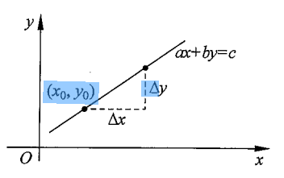
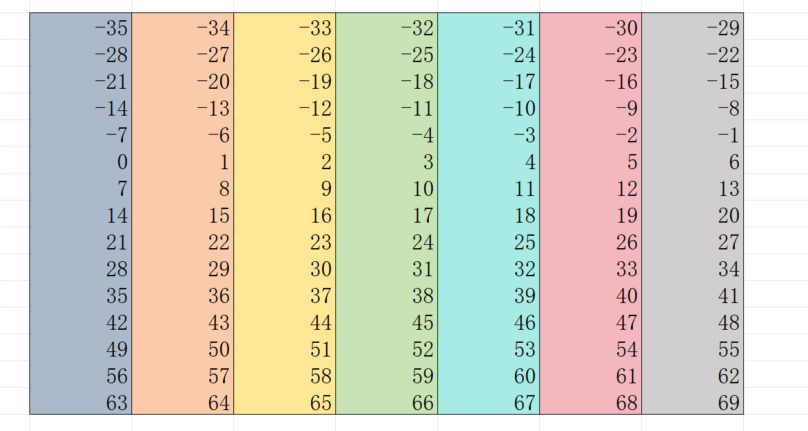
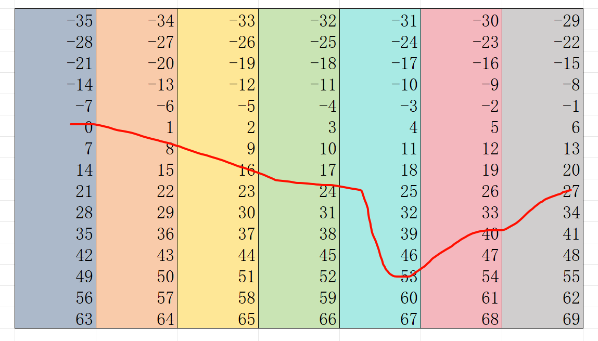
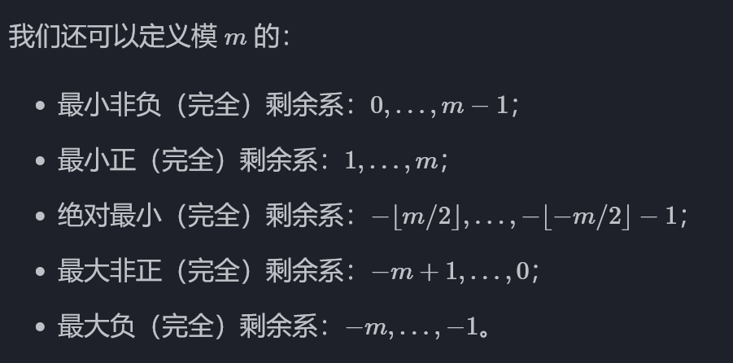
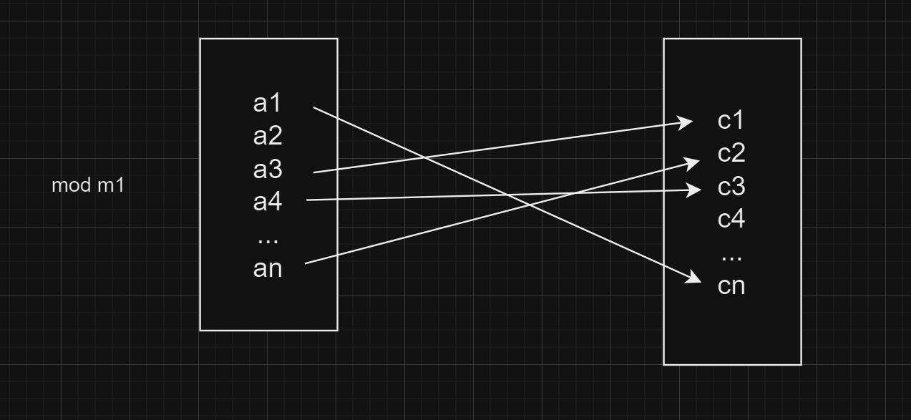
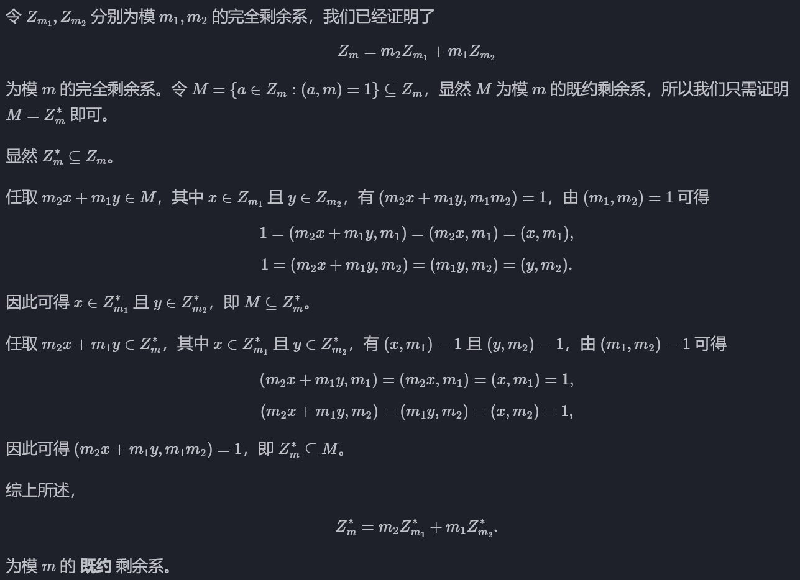
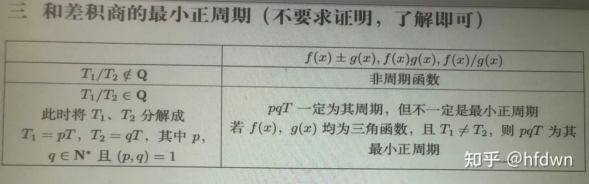

# 信息安全数学CrashCrouse

## 写作前的一点哔哔

暂无，直接开冲

## <a id="home" href="#">目录</a>

>  点击可跳转，点击标题可跳转回来。

- [](#1)
- [](#2)
- [](#3)
- [](#4)
- [](#5)
- [](#6)
- [](#7)
- [](#8)
- [](#9)
- [](#10)
- [](#11)
- [](#12)

# <a id="1" href="#home">整数除法与余数</a>

## 亿点术语

### 整除与不整除

如果$a | b$，那么$b=aq$，同时$b\%a==0$

这个时候，我们说：

- b可以被a整除
- b是a的倍数
- a是b的约数、因数
- 除了1以及自身，其他的约数都叫做真约数，$\pm 1$和$(\pm 自身)$被称作平凡约数。举个例子：3有$\pm 1$和$(\pm 3)$作为平凡约数，而16有2、4、8作为真约数。

其中，整除有一些性质：

- $b=qa+c \land a|b\Rightarrow a|c$
- $a|b\Leftrightarrow ma|mb\;,\;|a|\leq b\;,\;-a|b\;,\;a|-b$
- $a|b\land a|c\Rightarrow a|(xb+yc)$
- $a|b\land b|a\Rightarrow b=\pm a$

对于无法整除的数字a、b，有带余除法式子$b=qa+r$

其中，r被称作余数，$0\leq r < a$。余数可正可负，但是余数的正负是根据被除数决定的，一般都会令余数为正，但是有时会可能会讨论到负余数的情况。

比如：$11\%7=4$、$-11\%7=-4$、$-11\%-7=-4$

不难得知：相邻的整数a个整数被a除了之后，一定会恰好取完上述式子中r的所有情况（也即$r=0,1,..,a-1$），这里面“r的所有情况”可以组成： “模a的剩余系” 。

# <a id="2" href="#home">数字的基底</a>

## 素数（质数）与互素（互质）

上面讨论了带余数的除法，其中涉及到了因数、平凡约数的概念。

那么对于一个数自身而言，如果一个数a只有平凡约数（也就是只有$\pm 1$、$\pm a$作为因因数、约数），那么$a$被称作素数。

常见的素数是：2、3、5、7、11、13、17、19、23、29 …… 
然后，大于3的素数都可以被这么描述：$6n\pm 1$

但是两个数之间的关系呢？我们有互素的概念。
如果两个数（a,b）之间有$(a,b)==1$或者$\gcd(a,b)==1$，那么这两个数就是互素的关系。


GCD就是最大公因数，就是把两个数a、b的所有因数列出来取最大。
比如：16的因数1、2、4、8、16，12的因数1、2、3、4、6、12，这里面求$\max(16的因数，12的因数)=4$了

与之相对的有最小公倍数LCM。

---

素数之间一定互素，但互素并不需要双方都是素数。
**很多定理只要求“互素”，而有些定理要求“必须是素数”，这一点得非常注意。**


还有一概念：就是**多个数互素以及两两互素**。

- 多个数互素就是$(a_1,a_2,...,a_n)$它本质上是先算$d_1=(a_1,a_2)$，然后算$(d_1,a_3)$这样一路算下去。
- 两两互素就是每个数之间都是互素的

举个例子：6、10、15 这三个数是互素的，但是两两并不互素。

借用代数基本定理去理解：**多个数互素只是代表着他们作为整体并没有公用的因子，而两两互素代表每两个之间就已经没有公用的因子了**。

## 代数基本定理、LCM

根据上面的观点，我们知道我们研究的是每个数的因数的情况。那么具体来说，每个数里面的因数情况是怎样的呢？

代数基本定理：$\forall x \in Z,\; \exist a_1、a_2、a_3,\;st. \quad x=p_1^{a_1}p_2^{a_2}...p_n^{a_n}$

人话就是：每一个整数x都可以唯一地分解为一些列不同幂次的素数的乘积。

举个例子就是：
$108=2^{2}\times 3^{3}\times 5^{0}\times 7^{0}\dots$
$29=2^{0}\times 3^{0}\dots29^{1}\dots$

那么，我们就可以求证LCM的计算公式了。

$$
a,b\in Z，由代数基本定理：\\
\left\{
    \begin{align*}
    a=p_1^{c_1}p_2^{c_2}...p_n^{c_n}\\
    b=p_1^{f_1}p_2^{f_2}...p_n^{f_n}
    \end{align*}
\right.\\
\Rightarrow\left\{
    \begin{align*}
    gcd(a,b)&=p_1^{\min(c_1,f_1)}p_2^{\min(c_2,f_2)}...p_n^{\min(c_n,f_n)}\\
    lcm(a,b)&=p_1^{\max(c_1,f_1)}p_2^{\max(c_2,f_2)}...p_n^{\max(c_n,f_n)}\\
    \end{align*}
\right.\\
\Rightarrow gcd(a,b)lcm(a,b)=ab
$$

所以求lcm的时候，直接$lcm=\dfrac{ab}{gcd}$就行了。

## 一些性质

对于GCD与LCM来说，有这个性质：$lcm\% gcd==0$；
理解上用代数基本定理很好理解：gcd有的素数因子lcm都有，gcd没有的lcm也有，所以gcd里面是不存在lcm没有的素数因子的，gcd也就一定能整除lcm。

这个性质可用于hdu4497。

而单对于GCD来说，就是一些公式上的性质：

1. $(a,0)=(a,a)=a$
2. $(a,b)=(a,b+qa)=(a+kb,b)$
3. $(a,b)^n=(a^n,b^n)$
4. $(a_1,a_2,a_3,...,a_{n-1},a_n)=(a_1,(a_2,(a_3,...,(a_{n-1},a_n))))$

下面会用**裴蜀定理**简单证一下性质2，因为它非常有用，而其他比较显然，4也只是一种从两个参数到多个参数的计算方法上的定义。

---

最大公约数还有如下与**互素相关**的性质：

- 排除无关的倍数

$b|ac\;\land\; (a,b)==1\Rightarrow b|c$

- 排除无关的因子

$(a,b)==1 \Rightarrow (a,bc)=(a,b)$

- 有效因子组合（这里的$(a,b)==1$是为了保证a、b乘积比c小）

$b|c\;\land\; a|c\;\land\; (a,b)==1 \Rightarrow ab|c$

- 互素整体乘积仍然互素：

对于数组$a_i$、$b_j$，如果遍历i、j发现$(a_i,b_j)==1$，那么$(\prod_ia_i,\prod_jb_j)=1$

- 互素整数乘积是完美 $m$ 次幂时各因子也分别是完美 $m$ 次幂

如果存在一个整数$v$和一个内部两两互素的数组$(a_i,a_j)=1$，满足$v^m=\prod_i a_i$，那么$\sqrt[m]{a_i}\in Z$（是一个整数）

---

而对于LCM来说呢：

1. $a|b \Rightarrow [a,b]=b$
2. $[a,1]=[a,a]=a$
3. 如果数组$a_i$里面每一个$a_i$都满足$a_i|m$，那么$\Rightarrow [a_1,a_2,...,a_n]|m$
4. $[a,b,c][ab,bc,ac]=[a,b][b,c][a,c]$
5. $[a^n,b^n]=[a,b]^n$

这里用代数基本定理证明一下4。

$$
[a,b,c]=p_1^{\max(a,b,c)}p_2^{\max(a,b,c)}\dots
$$

$$
[ab,bc,ac]=p_1^{\max(ab,bc,ac)}p_2^{\max(ab,bc,ac)}\dots
$$

$$
\begin{align*}
    &\max(a,b,c)\times\max(ab,bc,ac)\\
    &=\max((a,b,c)\times(ab,bc,ac))\\
    &=\max(a^2b,abc,a^2c,ab^2,b^2c,abc,abc,bc^2,ac^2)\\
    &=\max((a,b)(b,c)(a,c))\\
    &=\max(a,b)\max(b,c)\max(a,c)
\end{align*}
$$

这个证明过程有点像 “多项式分解” 了。

---

以及最后一点奇妙公式：

1. $(a,b)[a,b]=ab$ (这个已经证明过了)
2. $(ab,bc,ac)[a,b,c]=|abc|$(这个类比上面去记忆就好了)
3. $\dfrac{(a,b,c)^2}{(a,b)(b,c)(a,c)}=\dfrac{[a,b,c]^2}{[a,b][b,c][a,c]}$

这里证明一下3：

简单来说，假设a<b<c，根据代数基本定理的观点，我们会发现：

两个数字之间的gcd以及lcm，基本上就是素数幂次的最大值-最小值；

移动到一边之后，我们会发现有这样的关系：a-b、b-c、a-c（幂次上的关系）

然后我们会发现：a-b+b-c=a-c（还是幂次上的关系）；

那么在这里的a、c其实就可以抽象为三个数字对应素数幂次上最大/最小的情况。

$$
[a,b,c]=p_1^{\max(a,b,c)}p_2^{\max(a,b,c)}\dots \\
(a,b,c)=p_1^{\min(a,b,c)}p_2^{\min(a,b,c)}\dots \\
\begin{align*}
    &\dfrac{(a,b,c)^2[a,b][b,c][a,c]}{[a,b,c]^2(a,b)(b,c)(a,c)}\\
\end{align*}
$$

# <a id="3" href="#home">GCD从连除讨论到直接讨论</a>

## 欧几里得算法

欧几里得算法是求GCD的一种算法，具体过程如下：

$$
\begin{align}
    a&=bq_1+r_1\\
    b&=r_1q_2+r_2\\
    r_1&=r_2q_3+r_3\\
    \vdots\nonumber\\
    r_{n-2}&=r_{n-1}q_{n}+r_{n}\\
    r_{n-1}&=q_{n}r_{n}
\end{align}
$$

先不问为什么要用除数除余数，先看过程。过程中根据带余除法的性质($r< b$)，我们观察到$0\leq r_{n}<r_{n-1}<r_{n-2}<...<r_{2}<r_{1}$。

这里不难看出，数列$r_n$的极限是0，这里我们令$r_{n+1}=0$，所以最后一个式子没有余数。

基于此，我们发现$r_n$把$r_{n-1}$整除了，而$r_{n-1}$和$r_{n}$又可以表示$r_{n-2}$，$r_{n-2}$和$r_{n-1}$可以表示$r_{n-3}$ …… 

这样递推下去，a、b都可以用$r_{n}$来表示：

$$
a=f(q_1,q_2,\dots,q_n)r_n\\
b=g(q_2,q_3,\dots,q_n)r_n
$$

~~因为量子力学~~，$f\neq g$，所以$r_n$就是$\gcd(a,b)$了。

要是硬想推公式证明 $f\neq g$ 也行，这里就不推了。

## 裴蜀定理 or 贝祖定理

基于欧几里得算法的过程：

$$
\begin{align*}
    a&=bq_1+r_1\\
    b&=r_1q_2+r_2\\
    r_1&=r_2q_3+r_3\\
    \vdots\nonumber\\
    r_{n-2}&=r_{n-1}q_{n}+r_{n}\\
    r_{n-1}&=q_{n}r_{n}
\end{align*}
$$

我们在前面发现：$a$、$b$都可以用$r_{n}$来表示。

那么这里我们从上往下看：第一个式子里面只有一个$r_1$是未知数，$r_1$可以用a、b表示，而第二个式子里面只有$r_2$是未知数，同样的可以用b+$r_1$表示。

……

这是熟悉的味道 —— 我们可以不断地通过如此的替换去用$a$、$b$得到$r_n$的表达式。

具体来说：

$$
\begin{align*}
    a &= bq_{1} + r_{1} \\
    r_{1} &= a - bq_{1} \\
    b &= r_{1}q_{2} + r_{2} \\ \nonumber &= (a - bq_{1})q_{2} + r_{2} \\
    r_{2} &= b - (a - bq_{1})q_{2}\\
    r_{1} &= r_{2}q_{3} + r_{3} \\ \nonumber &= (b - (a - bq_{1})q_{2})q_{3} + r_{3}\\
    \vdots\nonumber \\
    r_{n}&=F(q)a+G(q)b
\end{align*}
$$

因为$gcd(a,b)=r_n$，而且 F(q)、G(q)都是一些具体整数乘算的结果，我们这里令$q=F(q)$、$p=G(q)$；

那么我们便有了这个裴蜀定理：

对于任意正整数a、b，我们都存在整数p、q满足这个式子：$gcd(a,b)=qa+pb$。

## 基于裴蜀定理证明性质

上面我们说：$(a,b)=(a,b+k_1a)=(a+k_2b,b)$。
这个东西对于只是知道“带余除法”的我们，是很不显然的。

那么其实我们可以这样去看：

$$
gcd(a,b)=qa+pb=q_1a+p_1(b+k_1a)=q_2(a+k_2b)+p_2b
$$

省流来说，这里就是把a、b用其他的a、b函数来替代，从而达到一个类似 “向量换底表示” 的效果。


## 丢番图问题

在学习丢番图方程时，常从线性或简单二次形式入门，再逐步了解更复杂的高次或几何形式。

主要有以下类型：

- 线性丢番图：$ax+by=c$
- 多元线性丢番图：$a_{1}x_{1}+a_{2}x_{2}+a_{3}x_{3}+\cdots+a_{n-1}x_{n-1}+a_{n}x_{n}=c$
- 高次丢番图：$x^{n}+y^{n}=z^{n}$
  - 勾股定理：$x^{2}+y^{2}=z^{2}$
  - 大费马定理：$x^{n}+y^{n}=z^{n}\quad $when $n>2$ the equation is invalid.
  - Pell方程（一个双曲线）：$x^{2}-Dy^{2}=1$
- 指数丢番图：$a^{x}+b^{y}=c^{z}$

相关问题：
椭圆方程上的有理点构造问题。
扩展欧几里得算法（线性情况）、连分数法（二次Pell方程）、Lattice-based 方法（格上求解）。

同余问题常涉及到二阶丢番图问题。

## 二阶丢番图由特解到通解

对于$ax + by = c$，如果（$\gcd(a,b) \mid c$） （也就是$c \% \gcd(a,b) = 0$）

> 注：这里的c也可能是的负的 …… 因为 …… 

如果我们能得到一个特解$x_{0}$、$y_{0}$，我可以很顺利地得到对应的整数通解，这一点类似微分方程的求法：

$$
\begin{align*}
 x&=x_{0}+\frac{b}{\gcd(a,b)}n\\
 y&=y_{0}-\frac{a}{\gcd(a,b)}n
\end{align*}
$$

这个式子是怎么来的呢？

试想：$x$每增加一个1 ，也即式子$x=x_{0}+n$ ，那么对应到等式中y就需要减少一个$\frac{a}{b}$

那么x每增加一个b，也即式子$x=x_{0}+bn$，那么对应到等式中y就需要减少一个$\frac{ab}{b}=a$

基于此，给x和y的系数同时除以$\gcd$，那么就可以得到**最小步长的通解公式**（因为这样算出来n的系数是最小的，再除别的什么就要出现分数了），保障不会漏掉什么通解。

但要是如果$\gcd(a,b) \nmid c$ （也就是$c \% \gcd(a,b) \neq 0$），那么就不会有任何一个点在格子点上，自然也不会有什么整数解 …… 一个解都没有！

上面的说明对应下面的图解 —— 为什么n前面是那样子系数呢？



## 用欧几里得算法 求 丢番图特解

首先呢，我们知道$(a,b)=(a-b,b)=(a-2b,b)=(a-\lfloor\frac{a}{b}\rfloor b,b)=(b,a\mod b)$

然后结合裴蜀定理，我们知道$(a,b)=xa+yb=(b,a \mod b)=x_1b+y_1(a \mod b)$。

到这里都很丝滑，对吧？

然而，这个问题的“规模”虽然被缩小了，但是我们还是不能一眼看出$x_1$、$y_1$的解。

所以我们继续缩小问题，直到 —— 

$(a,b)=(b,a\mod b)=(a\mod b,b\mod (a\mod b))=...=(num,0)$

在重复计算了n次后，对于最后的结果$(num,0)$，我们写其裴蜀定理：$(num,0)=x_nnum+y_n0$

这个时候，你tm告诉我，$x_n$、$y_n$是多少？

$$
(num,0)=(num,num)=num=x_nnum+y_n0=x_nnum\\
x_n=\frac{num}{num}=1
$$

ok，既然$x_n$、$y_n$都能一眼丁真了，那么通过这个解以及GCD的性质$(a,b)=(b,a\mod b)$，求出式子 $(a,b)=xa+yb$ 里面的$x$、$y$呢？

换句话说，式子 $(a,b)=xa+yb=(b,a \mod b)=x_1b+y_1(a \mod b)$ 里面$x$、$y$、$x_1$、$y_1$ 之间的关系是什么？

$$
\begin{align*}
    &xa+yb=x_1b+y_1(a \mod b)\\
    &xa+yb=x_1b+y_1(a-\lfloor\frac{a}{b}\rfloor b)\\
    &xa+yb=ay_1+x_1b-y_1\lfloor\frac{a}{b}\rfloor b\\
    &xa+yb=ay_1+b(x_1-y_1\lfloor\frac{a}{b}\rfloor)\\
\end{align*}
$$

好了，我们更直接地把整个扩展欧几里得算法的过程写出来。
令$a_1=b,b_1=a\mod b$，随着计算的进行令为$a_2,b_2,a_3,b_3,\dots$ 以此类推。

$$
\begin{align*}
    (a,b)       \quad &(a,b)=xa+yb\\
    (b,a\mod b)\quad &(a_1,b_1)=x_1b+y_1(a\mod b)\\
    \vdots\\
    (num,0)\quad &(a_n,b_n)=x_nnum+y_n0
\end{align*}
$$

而每一层之间的关系是：

$$
xa+yb=ay_1+b(x_1-y_1\lfloor\frac{a}{b}\rfloor)\\
x_1a_1+y_1b_1=a_1y_2+b_1(x_2-y_2\lfloor\frac{a_1}{b_1}\rfloor)\\
\vdots\\
x_{n-1}a_{n-1}+y_{n-1}b_{n-1}=a_{n-1}y_{n}+b_{n-1}(x_{n}-y_{n}\lfloor\frac{a_{n-1}}{b_{n-1}}\rfloor)
$$

这样，我们就能通过递归Coding的方式去最终接触二阶丢番图的解了。

板子代码：

```cpp
using ll = long long ;
ll exgcd(ll a,ll b,ll& x,ll& y)
{
    if(b==0){
        x=1,y=0;
        return a;
    }
    ll d = exgcd(b,a%b,y,x);
    y = y-x*(a/b); //(*) 
    //这一步在n-1层，然后做的操作是 x_n - (a_{n-1}/b_{n-1})y_n
    return d;// 顺便返回公因数 GCD
}
```

求出了特解之后，我们就能按照之前在二阶丢番图那里写的通解公式去求出通解的表达式了。

这个代码也可以用于求余 —— 因为一元同余方程本质上可以写成二阶丢番图方程的。

然后你可能会好奇，**为什么一定是$y=0$呢？其他数行不行了**？
经过作者验证，其实是可以的 —— y=多少只决定了x、y最后算出来的绝对值有多少，y=0算出来的绝对值最小，最不容易溢出。

## 多元丢番图

多元丢番图方程，形如：

$$
a_1x_1+a_2x_2+...+a_nx_n=c
$$

当且仅当$\gcd(a_{1},a_{2},a_{3},\cdots,a_{n-1},a_{n}) \mid c$，这个方程组有tmd无数个解。

然后呢，像下面这样，从后往前依次求解就行了，其中$d_2=\gcd(a_1,a_2)$，其他的以此类推。

$$
\left\{
    \begin{aligned}
        &a_{1}x_{1}+a_{2}x=d_2t_2\\
        &d_{2}t_{2}+a_{2}x=d_3t_3\\
        &\vdots\\
        &d_{n-1}t_{n-1}+a_{n}x=d_nt_n
    \end{aligned}
\right.
$$

## 扩展欧几里得算法*

111

# 从模下线性等式到模下线性方程组

## 同余与同余的性质

同余式就是长成这样的式子：$a\equiv b(\mod n)$ 。

下面是一些普通的性质：

1. 正整数a，b对n取模，它们的余数相同，记作：$a\equiv b(\mod n)$
2. 若$a-k*n=b$，则$a\equiv b(\mod n)$；换而言之，我们可以将同余式 $a\equiv b(\mod n)$ 与等式 $a\equiv b+k*n$ 互化
3. 若$a\equiv b(\mod n)$且$c\equiv b(\mod n)$，则$a\equiv c(\mod n)$
4. 若$a\equiv b(\mod n)$，则$a+c\equiv b+c(\mod n)$ 
5. 若$a\equiv b(\mod n)$，且$c\equiv d(\mod n)$，则 $a+c\equiv b+d(\mod n)$ or $a+d\equiv b+c(\mod n)$（乘法的结论类似）
6. 若$a\equiv b(\mod n)$，则$a^k\equiv b^k(\mod n)$，

那么，基于上面的性质2，我们可以将这个一元同余式转换为二阶丢番图 

$$
ax\equiv b(\mod m) \quad \Rightarrow \quad ax+my=b；
$$

设$d=\gcd(a,m)$，如果有$d \mid b$（也即$b\mod d == 0$），那么有$d$个解；反之无解。

至于为什么有d个，那是因为：$x=x_{0}+\dfrac{m}{d}n$，**解之间的间隔是 $\dfrac{m}{d}$**，一旦超过d个$\dfrac{m}{d}$就会取到重复的数值。

这里面，x每个解对应于不同的**同余类**，**同余类**下面会涉及到。

如果恰好 $d=1$ ，那么就有唯一解！
在有唯一解情况下，我们才能求出唯一的逆元，如果多余一个解，那么每个解都不是逆元 —— 逆元是唯一的。 

**进阶一点的性质：**

1. $d|a \land d|b \land d|m$的时候，有$\dfrac{a}{d}=\dfrac{b}{d}(\mod \dfrac{m}{d})$
2. $d|m$的时候，有$a=b(\mod d)$
3. 若$a,b\in Z,d,m\in N^*$，则当$a\equiv b\mathrm{~(mod~}m)$成立时,有$(a,m)=(b,m)$。若$d$能整除$m$及$a,b$中的一个,则$d$必定能整除$a,b$中的另一个。

具体来说：性质1-2的区别就是；

性质1 是转二阶丢番图进行同时除以来保证等式成立而得到的；
性质2 则是因为$a=b(\mod m) \Leftrightarrow a-b=0(\mod m)$，如果一个数能被m整除，那么也一定能被它的因子整除

而性质3看起来就比较特别：
假设 $a=b (\mod m)$，那么写成二阶丢番图就是$x_1a+y_1m=x_2b+y_2m$。

这里不难看出结论3的正确性。

## 求逆

## 同余类与剩余系

同余类（剩余类）的定义是：根据全体整数mod m 后得到的不同余数划分成的不同同余类；相同余数的数字被划到一起；

模m的m个同余类分别记为$[i]$，$[i]$为这个同余类除m所得的余数。

所有同余类构成的集合是 $Z_m:=\{r\mod m,0\leq r < m\}$；

比如说：$\mod 5$ 的$Z_{5}$集合里面就包含
$[0]_5=\{\dots,-15,-10,-5,0,5,10,\dots\}$
$[1]_5=\{\dots,-14,-9,-4,1,6,11,\dots\}$
$[2]_5=\{\dots,-13,-8,-3,2,7,12,\dots\}$
$[3]_5=\{\dots,-12,-7,-2,3,8,13,\dots\}$
$[4]_5=\{\dots,-11,-6,-1,4,9,14,\dots\}$

由 抽屉原理 可知：

- 任取 m+1 个整数，必有两个整数模 m 同余。
- 存在 m 个两两模 m 不同余的整数。

既约同余类：对于m个同余类中的一个同余类$r\mod m$，如果余数的结果r和m**互素**，那么这个同余类就是既约同余类(既然约剩余类)；

既约同余类全体全体构成一个集合 $Z^*_m=\{r\mod m,0\leq r<m \land (r,m)=1\}$；

举个例子：mod 16 的$Z_{16}$集合里面里面就需要去掉这些同余类：$x=0 (\mod 16)$、$x=2 (\mod 16)$、$x=4 (\mod 16)$、$x=6 (\mod 16)$、$x=8 (\mod 16)$、 $x=10 (\mod 16)$、$x=12 (\mod 16)$、$x=14 (\mod 16)$

（完全）剩余系：

> 定义1：在模m 体系中，对于任意一个整数x，我都能在m个整数数组 $a_1,a_2,\dots,a_n$ 中找到对应的和x相等的模结果，那么这m个数就叫做（完全）剩余系。

从定义中可以看出，剩余系看起来挺像一个同余类的；**但“完全剩余系”并不是单个同余类，而是一整组覆盖了所有不同同余类的代表元**。
不过上面这个定义还是有点 …… 我们换一种说法。

> 定义2：在整数模m的所有剩余类中各取一个代表元 $a_1,a_2,..,a_m,(a\in[i-1],2=1,2,..,m)$,则称$a_1,a_2,...,a_m$为模$m$的完全剩余系。完全剩余系$0,1,2,...,m-1$称为最小非负完全剩余系。

比如说下面这张图中：



你所能看到的部分就是同余类，每一种颜色代表一种类，但具体来说，你想取哪一个数字作为这一条颜色的代表元 —— 那就随便。

比如下面两种都是可行的：

<div style="display:flex;justify-content:space-around;" >
    
    
</div>

这对于其他情况都是同理的：

$$
\begin{align*}
&[0]=\{..,-2m,-m,0,m,2m,.\}\\
&[1]=\{.,-2m+1,-m+1,1,m+1,2m+1,…\}\\
&[2]=\{..,-2m+2,-m+2,2,m+2,2m+2,.\}\\
&\vdots\\
&[m-1]=\{..,-2m+(m-1),-m+(m-1),m-1,m+(m-1),2m+(m-1),.\}
\end{align*}
$$

举例：模5的一个完全剩余系可以是{0,1,2,3,4}、或{1,2,3,4,5}、或{2,4,6,8,10}等等。这些集合"依次代表了”了模5下所有同余类。

当然还有其他一些花里胡哨的剩余系：



**既约剩余系**：在剩余系里面挑出与模数m互质的代表元r，然后每个满足$(x,m)=1$的x，都能找到代表元r。
值得注意的是，从剩余系得到既约剩余系剩余系统的时候，我们还需要去掉0，因为$(x,0)=(x,x)=x\neq 0$。

在模m的一个剩余类当中，如果有一个数与m互素，则该剩余类中所有的数均与m互素，这时称该剩余类与m互素。

**Prop1**：与m互素的剩余类的个数称为欧拉函数，记为$\varphi(m)$,等于$Z_m$当中与m互素的数
的个数。对于任意一个素数$p$，$\varphi(P)=p-1$。
**Prop2**：在与m互素的$\varphi(m)$个模m的剩余类中各取一个代表元 $a_1,a_2,,a_{\varphi(m)}$，它们组合成的集合称为模m的一个既约剩余系或简化剩余系。$Z_m$中与m互素的数构成模m的一个简化剩余系，称为最小非负简化剩余系。

## 剩余系的复合1

首先讨论完全剩余系和既约（简化）剩余系的加减乘运算性质。

定理1：

> 对于一个整数a、任意整数b，a满足$(a,m)=1$，当x遍历完一个模m完全剩余系的时候，$ax+b$也遍历完一个模m完全剩余系。（$m$是集合）

定理2：

> 设两个整数$(m_1,m_2)=1$，当$x$遍历完一个模$m_1$完全剩余系的时候，当$y$遍历完一个模$m_2$完全剩余系的时候，则$m_1y+m_2x$ 遍历完一个模$m_1m_2$完全剩余系。（$m_1$,$m_2$是集合）
> 有没有注意到这里的y遍历的是$m_2$但是乘的确实是$m_1$呢？

---

定理3：

> 设$m$是正整数。整数$a$满足$\gcd(a,m)=1$。若$c$遍历模$m$的一个既约剩余系，则$ax$也遍历模$m$的一个简化剩余系。（$m$是集合）
> 这里没有了常数b，是因为定义中的互素条件不能违反；数x既然mod完之后是和m互素的，那么根据 $(a,m)=(a-\lfloor\dfrac{a}{m}\rfloor m,m)=(a\mod m,m)$ 那么 mod 之前肯定也是互素的；如果$x\nmid m\land a\nmid m$，那么肯定也有$ax\nmid m$

定理4：

> 设两个整数$(m_1,m_2)=1$，当$x$遍历完一个模$m_1$既约剩余系的时候，当$y$遍历完一个模$m_2$既约剩余系的时候，则$m_1y+m_2x$也遍历完一个模$m_1m_2$既约剩余系。（$m_1$,$m_2$是集合）

---

上面的证明大同小异，核心就是：**证明一一对应**。

因为，如果复合出来想要是完整的一个剩余系，除非是一一对应，否则的话数量会减少，那么针对于对应的剩余系就不能 “填满” —— 自然也不能对任意整数都找到同余了。

所以如果证明一一对应，那么我们可以采用反证法的思路 —— 证明没有一个不对应即可。

---

**证明定理1：**

假设：$\exist i,j$，其中$i\neq j$，使得$aa_i+b\equiv aa_j+b (\mod m)$；

因为$b\equiv b (\mod m)$、$a\equiv a (\mod m)$，所以$a_i\equiv a_j (\mod m)$；

但是$a_i$、$a_j$，都是同一个剩余系里面的，代表元都是不同的，取模结果自然不同，故矛盾。
故 $\forall \exist i\;,\;j$ ，其中$i\neq j$，有 $aa_i+b\not\equiv aa_j+b (\mod m)$

那么既然，一个剩余系元素 $a_i$ 对应一个 $aa_i+b$ ，那是不是 $m$ 个就对应 $m$ 个不相同的呢？

因为理论中 $aa_i+b$ 还是 mod m 体系内的，所以$m$个不重复的 $aa_i+b$ 自然覆盖了所有的取值情况 —— 也就是构成了新的剩余系。



---

**证明定理2：**

和上面类似，令$m_1y_1+m_2x_1=m_1y_2+m_2x_2 (\mod m_1m_2)$

因为$m_1 | m_1m_2$，所以有$m_1y_1+m_2x_1=m_1y_2+m_2x_2 (\mod m_1)$

则 $m_2x_1=m_2x_2 (\mod m_1)$，$x_1=x_2 (\mod m_1)$

这显然是不对的，因为$x_1$、$x_2$所在的$m_1$，是两两不模同余的。

这里可以反推一下，为什么是$x$乘以$m_2$？

如果不是的话，就会化简到一个结论：$m_2y_1=m_2y_2 (\mod m_1)$

这因为$y_1$和$y_2$都是取自另一个模同余系统的，所以并不能说明在另一个互素的模系统中，是一定不相等的 —— 没有这种定律。

举个例子：$m_1 = 7$ 、$m_2 = 15$

下面的证明类似，就不重复了；只不过需要稍微说明一下生成出来的部分是和模互素的。

第三个说明在了题目下面，这里说明第四个：

已知$(x,m_1)=(y,m_2)=(m_1,m_2)=1$，然后我们需要说明$(m_1y+m_2x,m_1m_2)=1$

假设有$(m_1y+m_2x,m_1m_2)=p\neq 1$；

所以存在因子使得$p|m_1m_2$，然而$(m_1,_2)=1$，那么只能有$p|m_1$或者$p|m_2$

如果$p|m_1$，则式子中可得$p|(m_1y+m_2x)\Rightarrow p|m_2x$，最后得$p|x$。

但是明明$(x,m_1)=1$，所以不可能同时有$p|x$和$p|m_1$的。

反之也同理，所以不存在同余数情况。

又或者我们可以采用下面这种子集法：

<!--  -->


## 剩余系的复合2

1. 对于一个$(a,m_1)=1$的a，当x遍历完$m_1$的完全剩余系，当y遍历完$m_2$的完全剩余系的时候，$ax+m_1y$遍历完$m_1m_2$的完全剩余系。

证明方法与上面的类似，令 $ax_1+m_1y_1=ax_2+m_1y_2(\mod m_1m_2)$。
然后有：$ax_1+m_1y_1=ax_2+m_1y_2(\mod m_1)$
接着：$ax_1=ax_2(\mod m_1)$
最后不符：$x_1=x_2(\mod m_1)$

说明是可以遍历完的。


2. 对于一个很复杂的$m=\prod m_i$，当$x_1$遍历完$m_1$的完全剩余系，当$x_2$遍历完$m_2$的完全剩余系的时候 .... ，$x_1+m_1x_2+m_1m_2x_3+...\prod m_i x_n = \sum_{i=1}^{n}(\prod_{j=1}^{i-1}m_j)x_i$遍历完$m_1m_2...m_n$的完全剩余系。

证明的话 …… 大同小异。

当我们$\mod m_1m_2$的时候，我们发现会得到式子

$$
x_1+m_1x_2=x^{'}_1+m_1x^{'}_2(\mod m_1m_2)
$$

然后就是故技重施啊 …… 

## 欧拉函数的积性

在剩余系复合1中的定理4，我们知道了以下规则：

> 设两个整数$(m_1,m_2)=1$，当$x$遍历完一个模$m_1$既约剩余系的时候，当$y$遍历完一个模$m_2$既约剩余系的时候，则$m_1y+m_2x$也遍历完一个模$m_1m_2$既约剩余系。（$m_1$,$m_2$是集合）

那么我们可以知道，一个模$m_1$既约剩余系和另一个模$m_2$既约剩余系的时候，会不重不漏地生成一个模$m_1m_2$既约剩余系。

我们又知道：既约剩余系的大小被称作欧拉函数，记作$\varphi(m)$，这里的m就是模。

那么在公式中，因为剩余系复合计算的特性 —— **不重不漏**的缘故，遍历的时候产生的每一个(x,y)对应的$m_1y+m_2x$，都是不一样的。

那么由此一来，$m_1y+m_2x$ 的个数是不是就对应着 $(x,y)$ 的个数呢？是不是代表 $m$ 既约剩余系的大小呢？

$(x,y)$ 的个数是不是$m_1$既约剩余系和$m_2$既约剩余系大小的乘积呢？

因为所以，$\varphi(m)=\varphi(m_1m_2)=\varphi(m_1)\varphi(m_2)$

值得注意的是，$(m_1,m_2)=1$，所以欧拉函数满足积性函数的定义（而不是完全积性函数）。

## 用迭代法求解同余方程组

首先，我们有同余方程，而有方程就有方程组：

$$
\begin{align*}
 &x\equiv a_{1}(\mod m_{1})\\
 &x\equiv a_{2}(\mod m_{2})\\
 &\vdots\\
 &x\equiv a_{n}(\mod m_{n})
\end{align*}
$$

那么我们一个一个满足：

$$
\begin{align*}
    &x=a_{1}+m_{1}n_{1}\\
    &x=a_{2}+m_{2}n_{2}\\
    &\vdots\\
    &x=a_{r}+m_{r}n_{r}
\end{align*}
$$

也就是会得到：

$$
\begin{align*}
    n_{1}&=\dfrac{a_{2}+m_{2}n_{2}-a_{1}}{m_{1}} (\mod m_{2})=(a_{2}+m_{2}n_{2}-a_{1})*m^{-1}_{1} (\mod m_{2})\\
    n_{1}&=\dfrac{a_{3}+m_{3}n_{3}-a_{1}}{m_{1}} (\mod m_{3})=(a_{3}+m_{3}n_{3}-a_{1})*m^{-1}_{1} (\mod m_{3})\\
    &\vdots\\
    n_{1}&=\dfrac{a_{r}+m_{r}n_{r}-a_{1}}{m_{1}} (\mod m_{r})=(a_{r}+m_{r}n_{r}-a_{1})*m^{-1}_{1} (\mod m_{r})
\end{align*}
$$

把$n_1$当成x，我们继续：

$$
\begin{align*}
    n_{2}&=\dfrac{a_{3}+m_{3}n_{3}-a_{2}}{m_{2}} (\mod m_{3})=(a_{3}+m_{3}n_{3}-a_{2})*m^{-1}_{2} (\mod m_{3})\\
    n_{2}&=\dfrac{a_{4}+m_{4}n_{4}-a_{2}}{m_{2}} (\mod m_{4})=(a_{4}+m_{4}n_{4}-a_{2})*m^{-1}_{2} (\mod m_{4})\\
    &\vdots\\
    n_{2}&=\dfrac{a_{r}+m_{r}n_{r}-a_{2}}{m_{2}} (\mod m_{r})=(a_{r}+m_{r}n_{r}-a_{2})*m^{-1}_{2} (\mod m_{r})
\end{align*}
$$

事情直到$n_{r-1}$结束：$n_{r-1}=\dfrac{a_{r}+m_{r}n_{r}-a_{r-1}}{m_{r-1}} (\mod m_{r})=(a_{r}+m_{r}n_{r}-a_{r-1})*m^{-1}_{r-1} (\mod m_{r})$

然后把$n_{r-2}$算出来：$n_{r-2}=[a_{r-1}+(a_{r}+m_{r}n_{r}-a_{r-1})*m^{-1}_{r-1}*m_{r-1}-a_{r-2}]*m^{-1}_{r-2}$

至于具体的计算，还是举个例子：

$$
\begin{align*}
 \begin{cases}
 x&=2(\mod 3)\\
 x&=3(\mod 5)\\
 x&=2(\mod 7)
 \end{cases}
\end{align*}
$$

由第一个式子：$\Rightarrow x = 2+3k\\$；
然后我们让第一个式子满足第二个式子：$x = 2+3k=3 (\mod 5)$，解得$k=2(\mod 5)$
也即$k=5n+2$，那么最终的式子变成：$x = 2+3k = 2+3(5n+2)=2+15n+6=15n+8$

故技重施：$x=15n+8=2(\mod 7)$，那么$15n=1(\mod 7)$，$n=1(\mod 7)$。
然后$n=7m+1$，则$x=15n+8=105m+15+8=105m+23$。

## 中国剩余定理求解同余方程组

### 内容

上面的方法是不错，但是有的时候可能效率不够高。
在算法层面，套公式的效率是最高的 —— 所以我们引入中国剩余定理来处理某些特殊条件的计算。

同样对于同于方程组：

$$
\begin{align*}
 &x\equiv a_{1}(\mod m_{1})\\
 &x\equiv a_{2}(\mod m_{2})\\
 &\vdots\\
 &x\equiv a_{n}(\mod m_{n})
\end{align*}
$$

如果有$m_1,m_2,...,m_n$两两互素，那么我们有以下结论：
令$M_i=\frac{m_1m_2..m_n}{m_i}$

那么唯一解为：

$$
x=\sum a_iM_iM^{-1}_i
$$

### 一一映射法证明

首先，对答案取模验证$x=\sum a_iM_iM^{-1}_i=a_i(\mod m_i)$，发现只有$n_i$才能取出$a_i$的值，由此发现x与$(a_1,a_2,...,a_n)$一一对应。

然后，因为对于$x\neq y$，我们总能找到不少于一个的$m_i$去发现他们的不同余数$a_i$ —— 从而说明最终的特解是随着$a_i$的变化而变化，并且与$(a_1,a_2,...,a_n)$一一对应的，所以方程组总是有唯一解。

上述解符合这个特征，而符合特征的解一定唯一，所以上面的解就是答案；就算有其他答案，那也是形式上的差距。

又或者说，由剩余系的复合，我们可以记起来：

> 对于一个很复杂的$m=\prod m_i$，当$x_1$遍历完$m_1$的完全剩余系，当$x_2$遍历完$m_2$的完全剩余系的时候 .... ，$x_1+m_1x_2+m_1m_2x_3+...\prod m_i x_n = \sum_{i=1}^{n}(\prod_{j=1}^{i-1}m_j)x_i$遍历完$m_1m_2...m_n$的完全剩余系。

基于此，我们可以写出一个差不多的方程式：

> 对于一个很复杂的$m=\prod m_i$，当$x_1$遍历完$m_1$的完全剩余系，当$x_2$遍历完$m_2$的完全剩余系的时候 .... ，
> 
> $$
> \begin{align*}
&m_2m_3..m_nM^{-1}*1x_1+m_1m_3..m_nM^{-1}_2x_2+m_1m_2...m_nM^{-1}_3x_3+...+ m_1m_2...m*{n-1}M^{-1}_{n}x_n\\ 
&= \sum a_iM_iM^{-1}_i=a_i (\mod m)
\end{align*}
> $$
> 
> 遍历完$m_1m_2...m_n$的完全剩余系。

这里就不证明了，因为证明过程完全和前面的证明是一样的，就是多乘了一大坨系数。

### 数学归纳法证明

这个方法就更明确了一些。

**引理**：$ax\equiv b_1$的解$x_1$与$ax\equiv b_2$的解$x_2$叠加起来$x_1+x_2$是方程$ax\equiv b_1+b_2$的解答。

这个由同余方程的性质得到：

> 若$a\equiv b (\mod m)$且$c\equiv d(\mod m)$，则$a\pm c\equiv b\pm d(\mod m)$。

这里则是$ax_1\equiv b_1 \land ax_2\equiv b_2 \Rightarrow a(x_1+x_2)\equiv b_1+b_2$

那么，对于两个同余方程的情况，我们有：

$$
\begin{align*}
    x&\equiv b_1 (\mod m_1)\\
    x&\equiv b_2 (\mod m_2)\\
\end{align*}
$$

对于上面的(1)、(2)式，我们可以拆分成两个方程组去分别求解，然后把解相加：

$$
\begin{align*}
    x&\equiv b_1 (\mod m_1)\tag{1}\\
    x&\equiv 0 (\mod m_2)\tag{2}\\
\end{align*}
$$

由(2)得到：$x=m_2y$，然后反带入(1)，得到$m_2y=b_1(\mod m_1)$，然后$y=b_1m_2^{-1}+\alpha m_1$
那么 $x=m_2y=m_2(b_1m_2^{-1}+\alpha m_1)=m_2m_2^{-1}b_1\quad(\mod m_1m_2)$

这里用 $\mod m_1m_2$ 是因为我们需要推导$\mod m_1m_2$下的情况，对于这个式子，我们$\mod m_1$、$\mod m_2$，都是可以的，因为这时候的$x$就是联立出来的$x$，所以$mod$完$m_1$、$m_2$之后的结果一定是要符合上面的（1）、（2）式的。

由于第二个方程和第一个是对称的，所以我们直接同理：

$$
x=m_1m_1^{-1}b_2\quad(\mod m_1m_2)
$$

然后根据相加的方法求到解：

$$
x=m_2m_2^{-1}b_1+m_1m_1^{-1}b_2=M_1M^{-1}_1b_1+M_2M^{-1}_2b_2\quad(\mod m_1m_2)
$$

说明，中国剩余定理在 $k=2$ 的时候是成立的。

接下来，假设 $k-1$ 的时候成立，尝试推出 $k$ 的时候成立，即我们知道：

$$
\begin{align*}
\begin{cases}
x\equiv b_1\quad(\mod m_1) \\
x\equiv b_2\quad(\mod m_2) \\
x\equiv b_3\quad(\mod m_3) \\
\vdots \\
x\equiv b_{k-1}\quad(\mod m_{k-1})
\end{cases}
\end{align*}
$$

解答为：

$$
x=M_1M^{-1}_1b_1+M_2M^{-1}_2b_2+\dots+M_{k-1}M^{-1}_{k-1}b_{k-1}\quad(\mod m_1m_2)
$$

因为我们要求k时候的情况，所以，所有k-1个方程情况下的参数全部加上个星号，如下：

令：$v$为$k-1$时候的$x$解，$m_*$代替表示$k-1$时候的乘积$m_*=m_1m_2...m_{k-1}$，$M_*$、$M_*^{-1}$，以此类推

那么，$k$个方程的解，等价于求解下面这个式子

$$
\begin{align*}
    x&\equiv v (\mod m_1m_2...m_{k-1}=m^*)\\
    x&\equiv b_k (\mod m_k)\\
\end{align*}
$$

因为$(m_1m_2...m_{k-1},m_k)=1$依旧满足，我们还是可以采取上面(1)、(2)式的求解方式：

$$
x=m_2m_2^{-1}b_1+m_1m_1^{-1}b_2\quad(\mod m_1m_2)
$$

套公式得到：

$$
x=m_km_k^{-1}v+m_*m_*^{-1}b_k\quad(\mod m_1m_2)
$$

然后分别考虑$m_*$和$m_*^{-1}$的值 —— 因为，$k-1$的$M_*$里面不包含$m_k$，所以这里需要想办法把$m_k$拼接进$M_k$，从而才能求出最终的表达式。

$$
m_*=\frac{m}{m_k}=M_k
$$

以及：

$$
\begin{align}
\because\;&m_km_k^{-1}=1\quad(\mod m_*)\tag{1}\\
\therefore\;&m_km_k^{-1}=1\quad(\mod m_i,i\in(1,k-1))\tag{2}\\
\because\;&M_{*i}M_{*i}^{-1}=1\quad(\mod m_i,i\in(1,k-1))\tag{3}\\
\therefore\;&m_km_k^{-1}M_{*i}M_{*i}^{-1}=1\quad(\mod m_i,i\in(1,k-1))\tag{4}\\
\because\;&M_{i}=m_kM_{*i}\tag{5}\\
\therefore\;&m_k^{-1}M_{*i}^{-1}=(m_kM_{*i})^{-1}=M_{i}^{-1}\tag{6}
\end{align}
$$

上面的步骤简单解释一下 ——就是为了把$M_{i}$、$M_{i}^{-1}$给弄出来这样方便合并。

而第1步来自于条件（两两互素），第2步则是GCD的性质，3-6就是合并的过程了，具体上就是计算$M_{i}^{-1}$。

那么答案前半部分的表达式就可以转变为：

$$
(m_km_k^{-1}v)=M_1M^{-1}_1b_1+M_2M^{-1}_2b_2+\dots+M_{k-1}M^{-1}_{k-1}b_{k-1}\quad(\mod m_1m_2)
$$

这个式子和前面k-1情况的式子长得很像，对吧？但这是k个方程式的情况，在k个的情况下，$k-1$的式子带个\* —— 前面的定义中明确了。

由此也德政了。

# 模下线性等式常用定理

## 威尔逊定理


## 费马小定理

### 内容

好像也没啥内容。

就长这样：$a^p=a\quad(\mod p)$，其中$p\perp a$，或者说 $(p,a)=1$ ，然后 $p$ 得是素数。

### 二项式展开证明

考虑$(1+x)^{p}$的二项式展开：

$$
\begin{align*}
    (1+x)^{p} = \sum_{i=0}^{p}\binom{p}{i}a_{i} = \binom{p}{0}a_{0} + \binom{p}{1}a_{1} + \binom{p}{2}a_{2} + \dots + \binom{p}{p-1}a_{p-1} + \binom{p}{p}a_{p}
\end{align*}
$$

根据：$C_{n}^m=\dfrac{n!}{(n-m)!m!}$，且 $p$ 是素数的情况下，我们知道：除了$C_{p}^{0}$ 或 $C_{p}^{p}$，其他都会被$\mod p$ 给化掉：

$$
\begin{align*}
    (1+x)^{p} &= \binom{p}{0}a_{0} + \binom{p}{p}a_{p} = 1+x^{p} (\mod p)\\
    (1+x)^{p} &- x^{p} = 1 (\mod p)
\end{align*}
$$

（上面的x和p互素，所以不能划掉）

这就是经典的 …… 不知道什么数列，但是是经典的一阶线性递推。

令$b_{n}=n^{p}$，上述式子可化为：$b_{n+1}-b_{n}=1\quad(\mod p)$。

由累加可得：$b_{n}=b_{1}+n-1=1^{p}+n-1=n\quad(\mod p)$；

则$b_{a}=a^{p}=a\quad(\mod p)$

德政

### 多项式展开证明

考虑 $a^{p}$ 的多项式展开：

$$
\begin{align*}
(1_{1}+1_{2}+1_{3}+\dots+1_{a-1}+1_{n})^{p}&=\sum_{i=0}^p\binom{p}{k_{1},k_{2},\dots,k_{n}}1^{x}=\sum_{i=0}^p\binom{p}{k_{1},k_{2},\dots,k_{n}}
\end{align*}
$$

在$\mod p$且$p$是质数的情况下，除了$\binom{p}{p,0,0,\dots,0,0}$、$\binom{p}{0,p,0,\dots,0,0}$等等都会变成0（因为没有数能消掉p除了它自己）；

ps：$\binom{n}{n_{1},n_{2},n_{3},\dots,n_{m-1},n_{m}}=\dfrac{n!}{n_{1}!n_{2}!\dots n_{m-1}!n_{m}!}$

那么在全选一个的情况下，就会有：

$$
\begin{align*}
    (1_{1}+1_{2}+1_{3}+\dots+1_{a-1}+1_{n})^{p}=a^{p}=1^{p}+1^{p}+\dots+1^{p}+1^{p}=a(\mod p)
\end{align*}
$$

德政

### 类剩余系计算证明

首先，我们有一个质数 $p$ 和一个与 p 互素的 $a$ 。

构造一个序列（去掉0的剩余系）：$A=\{1,2,...,p-1\}$

但是呢，他也是能进行乘法运算的：

$$
\prod A_i=\prod(A_i\times a)\quad(\mod p)
$$

简单证明，还是跟上面剩余系复合那样证明一个思路：**先证唯一性，再证数量相等**。

首先，显然：$(A_i\times a,p)=1$；剩余系去掉 0 再乘一个与模互素的数字，也还是剩余系去掉0。

其次，数量相等，这个能一眼看出来。

所以，$A_i$和$aA_i$是一一对应的，但是我们并不知道顺序，无法直接列等式 —— 但是我们知道他们整体上是相等的，所以我们相乘。

上面的乘法运算德政。

那么根据上面的式子展开：

$$
\begin{align*}
&\prod A_i=\prod(A_i\times a)\quad(\mod p)\\
&1\times2\times..\times A_i=1\times a\times2\times a\times..\times A_i\times a\quad(\mod p)\\
&(p-1)!=(p-1)!a^{p-1}\quad(\mod p)
\end{align*}
$$

德政。

### 数学归纳法证明

~~是真的骚，这个方法。~~

显然$1^p\equiv 1(\mod p)$

假设$a^{p}=a$成立（并作为条件），证明$(a+1)^{p}=a+1$成立。

然后正常二项式展开化简就行了：

$$
\begin{align*}
(a+1)^p&=C_{p}^{0}a^01^p+C_{p}^{1}a^11^{p-1}+...+C_{p}^{p}a^{p}1^{0}\quad(\mod p)\\
(a+1)^p&=C_{p}^{0}a^01^p+C_{p}^{p}a^{p}1^{0}\quad(\mod p)\\
(a+1)^p&=a^p+1\quad(\mod p)\quad\text{然后带入}a^{p}=a\\
(a+1)^p&=a+1
\end{align*}
$$

德政。

## 欧拉函数探索

### 基础内容

首先，在比较前面的地方，我们在证明剩余系的时候证明过了欧拉函数是积性函数。

那么欧拉函数的本体其实我们还没有分析过，所以还是得知道本体是怎样的。

首先，根据定义：

> 定义1：与m互素的剩余类的个数称为欧拉函数，记为$\varphi(m)$,等于$Z_m$当中与$m$互素的数的个数。对于任意一个素数$p$，$\varphi(P)=p-1$。
> 定义2：在与$m$互素的$\varphi(m)$个模$m$的剩余类中各取一个代表元$a_1,a_2,...,a_{\varphi(m)}$,它们组合成的集合称为模$m$的一个既约剩余系或简化剩余系。$Z_m$中与$m$互素的数构成模$m$的一个简化剩余系，称为最小非负简化剩余系。

剩余系中和模数m互素的的数字的个数为欧拉函数的数值，也就是：

$$
\varphi(m)=\sum_{i=1}^{n}[(i,m)=1]
$$

这 …… 不太像是一个能用的公式，顶多是说明了一下概念的方法。

首先，对于素数$p$，我们有：$\varphi(p)=p-1$。

结合后面需要用到的素数幂，我们有$\varphi(p^k)=p^k-p^{k-1}$。

证明：对于$p^k$，能和它互素的不能有$p$。

在所有不大于$p^k$的范围内，有多少个数是至少含有一个$p$的呢？

是不是$p^{k-1}$个呢，因为$1-p^{k-1}$只要乘上一个$p$，一定小于等于$p^k$且**至少**含有一个$p$。

这样我们就计算出来了，针对于素数幂的欧拉公式了。

结合代数基本定理，我们其实又可以去表示所有的整数了呢！

设$n\in N$，n不为1（$\varphi(1)=1$，它是有特殊值）

然后我们有：

$$
\forall n \in Z\;\;,\; \exist a_1、a_2、a_3,\;\;st. \;n=p_1^{a_1}p_2^{a_2}...p_n^{a_n}
$$

因此欧拉函数的公式为：

$$
\begin{align*}
\varphi(n)&=\varphi(p_1^{a_1}p_2^{a_2}...p_n^{a_n})\\
&=\varphi(p_1^{a_1})\varphi(p_2^{a_2})...\varphi(p_n^{a_n})\\
&=(p_1^{a_1}-p_1^{a_1-1})(p_{2}^{a_2}-p_2^{a_2-1})...(p_n^{a_n}-p_n^{a_n-1})\\
&=p_1^{a_1}p_2^{a_2}...p_n^{a_n}(1-\frac{1}{p_1})(1-\frac{1}{p_2})...(1-\frac{1}{p_n}\\
&=n(1-\frac{1}{p_1})(1-\frac{1}{p_2})...(1-\frac{1}{p_n})
\end{align*}
$$

---

下面有一个推论：

$\forall m,n\in N\land (n,m)\;\stackrel{?}{\sim}\; 1 \Rightarrow \varphi(nm)\varphi(\gcd(n,m))=\varphi(n)\varphi(m)\gcd(n,m)$

没什么很巧妙的思路 …… 可以用欧拉公式强行展开证明。

还有一个则是：$\varphi(2n)=\varphi(n)$，如果n是奇数。

这也是套公式。

### 欧拉反演（不知道是不是真叫这个）

然后还有一个就是与反演有关的，有人叫做“**欧拉反演**”：

$$
n=\sum_{d|n}\varphi(d)
$$

意思是，**因数的欧拉函数的和为数本身**。

这里的思路是，按照$\gcd$进行分组，然后数出每个分组的个数，求和得到n。

每个分组的个数的个数怎么求呢？其实就是用欧拉函数来求 —— 因为欧拉函数的概念里面有个数这个概念。

那么，接下来的思路就是去尝试 “让欧拉函数不重不漏地数出每个数字”。

我们令$k$遍历每个数字，然后我们求$(k,n)$等于多少，然后进行分类。

此时，我们的欧拉函数$\varphi(n)$只能数出$(k,n)=1$的部分。

$(k,n)=2,3,4...n-1$该怎么数呢？

很简单，只需要计算$(\frac{k}{(k,n)},\frac{n}{(k,n)})$所对应的$\varphi(\frac{n}{(k,n)})$即可。

那么我们令$d=(k,n)$，然后让 $d$ 遍历所有的公因数，不就行了？

遍历到某个公因数的时候，我们就加上这个公因数对应的欧拉函数$\varphi(\frac{n}{(k,n)})$，如果不知道这个公因数对应的欧拉函数$\varphi(\frac{n}{(k,n)})$怎么办呢？

递归 or 打表呗

所以我们能得到：

$$
n=\sum_{d|n}{\varphi(\frac{n}{d})}
$$

由于因数的对称性，我们$d$遍历所有的$gcd$的时候，$\dfrac{n}{d}$也遍历了一遍所有的可能，并且 $\dfrac{n}{d}$ 能取到所有d取到的数（前提是$d$能取遍$n$所有的因子，事实上还真可以，这里可以脑补一下）。

所以我们可以改写成：

$$
n=\sum_{d|n}{\varphi(d)}
$$

---

举个使用的例子：

$$
6=\varphi(1)+\varphi(2)+\varphi(3)+\varphi(6)=1+1+2+2
$$

$$
36=\varphi(1)+\varphi(2)+\varphi(3)+\varphi(4)+\varphi(6)+\varphi(9)+\varphi(12)+\varphi(18)+\varphi(36)
$$

下面列出一些欧拉函数的值，便于验证“欧拉反演”这个结论。

| $\varphi(1)=1$ | $\varphi(2)=1$ | $\varphi(3)=2$ | $\varphi(4)=2$ | $\varphi(5)=4$  |
| -------------- | -------------- | -------------- | -------------- | --------------- |
| $\varphi(6)=2$ | $\varphi(7)=6$ | $\varphi(8)=4$ | $\varphi(9)=6$ | $\varphi(10)=4$ |

没给出的也可以套公式手算。

## 欧拉定理

欧拉定理的内容是：

若$\gcd(a,m)=1$，则$a^{\varphi(m)}=1\quad(\mod m)$。

值得注意的是，m是任意正整数即可。

具体证明其实与费马小定理的证明别无二致：

$$
\prod A_i=\prod(A_i\times a)\quad(\mod p)
$$

不过，这里我们可以直接把 $A_i$ 定义为既约剩余系，然后个数为$\varphi(m)$个，这样这个乘法不证自明（在剩余系复合证明过了）。

然后就是消元，直到剩下$\varphi(m)$个a。

不难看出，当m是素数的时候，欧拉定理特化成费马小定理，费马小定理只是欧拉定理的一个特例。

欧拉定理与费马小定理是可以户政的：

## 扩展欧拉定理*

**Proposition：**
主要内容：

$$
a^b=
\left\{
\begin{align*}
&a^{b\mod \varphi(m)}&\qquad \gcd(a,m)=1,\\
&a^b,&\qquad \gcd(a,m)\neq 1    ,b<\varphi(m)\\
&a^{b\mod \varphi(m)+\varphi(m)},&\qquad \gcd(a,m)\neq 1,b\geq\varphi(m)
\end{align*}
\right.\quad(\mod m)
$$

---


**Lemma1**：整数幂具在模下有周期性

也就是说对于模幂序列： $a^{0},a^{1},...,a^{m-1}$  ，会存在$s$、$r$，使得 $a^0,...,a^r$ 互不相同，然后从$a^{r+1},...$，开始就每 $s$ 次循环一次。 


因为模m的情况下，整数幂是不会产生多于m个数的，所以整数的幂最晚比模数m大的时候就会开始重复（鸽巢原理or抽屉原理），但是有没有可能提前呢？不清楚 ——所以这里只是存在，但没说存在确定是多大。

---


**Lemma2**：a为素数的时候，式子成立。

> ps：由于整数可分解为素数幂的乘积，所以一旦素数的情况成立，那么就有机可乘。

1. 如果模数m不能被a整除 

这里的a是素数，也就是 $\gcd(a,m)=1$ ，这种情况就是原本欧拉定理所定义的情况。

根据欧拉定理 $a^b=a^{b-\varphi(m)}=a^{b-\lfloor\frac{b}{\varphi(m)}\rfloor\varphi(m)}=a^{b\mod \varphi(m)}$

2. 如果模数m能被a整除

也就是 $\gcd(a,m)\neq1$ ，那么原来欧拉定理的式子就用不了了，我们得重新写另一个复合形式的式子来进行间接的推导。

注意到： $a$ 是素数，而且 $m$ 能被整除，也就是存在 $m=a^rm^{'}$；

那么，对于$m^{'}$我们能写出$\varphi(m^{'})=1(\mod m)$。

那么接下来就需要考虑 $\varphi(m^{'})$ 和 $\varphi(m)$ 的关系了。

$$
\varphi(m)=\varphi(a^r)\varphi(m^{'})=(a^r-a^{r-1})\varphi(m^{'})=k\varphi(m^{'})(\mod m)
$$

所以，我们其实还是有：

$$
a^{\varphi(m)}=a^{k\varphi(m^{'})}=(a^{\varphi(m^{'})})^k=1^k=1(\mod m)
$$

然后，好像也证明完了？因为我们还是得到了和1相同的式子。

因为在 $b\geq\varphi(m)$ 的时候，我们可以套上面1的证明，得到

$$
a^b=a^{b-\varphi(m)}=a^{b-\lfloor\frac{b}{\varphi(m)}\rfloor\varphi(m)}=a^{b\mod \varphi(m)}
$$

如果在 $b<\varphi(m)$ 的时候，其实就是$\lfloor\frac{b}{\varphi(m)}\rfloor=0$ 的时候，带进去就好了：

$$
a^b=a^{b-\lfloor\frac{b}{\varphi(m)}\rfloor\varphi(m)}=a^{b}
$$

所以至此，所有在素数下的情况德政。

---

<u>**Lemma3**：a为素数幂的时候，式子成立。</u>

> 其实经过了前面的证明，我们知道，只要证明出欧拉定理在这个条件下的成立就万事大吉了。

令$a=p^k$，然后也是得考虑互不互质的情况，对吧？

互质的情况就直接符合欧拉定理的式子了，这里不证。

不互质的情况，我们可以依旧可以仿照上面写出 $\varphi(m^{'})$ 和 $\varphi(m)$ 的关系

注意到： $a$ 是素数幂，而且和 $m$ 有公因数$p^r$，也就是存在 $m=p^rm^{'}$；

$$
\varphi(m)=\varphi(p^r)\varphi(m^{'})=(p^r-p^{r-1})\varphi(m^{'})=k\varphi(m^{'})(\mod m)
$$

然后和上面一样的呗。

---

<u>**Lemma4**：a为任意整数的时候</u>

先证明两个幂函的情况，然后归纳证明。

# 模下幂等式

## 模下幂的最小正周期序列

模下幂的最小正周期，也就是满足  $a^n=1(\mod m)$ 的最小n。

在上面扩展欧拉定理的证明里面我们已经用鸽巢原理/抽屉原理说明了最小n的存在。

这个最小正周期叫做整数a在模m下的阶，记作$\delta_m(a)$ or $ord_m(a)$ 。

同时我们知道，有一个在$(a,m)=1$下是一定成立的：

$$
a^{\varphi(m)}=1(\mod m)
$$

从二者的描述上看，可以看的出来$\delta_m(a)<\varphi(m)$ 且 $\delta_m(a)\mid \varphi(m)$。

---


**性质1**：$a,a^2,a^3,...,a^{\delta_m(a)}$ 两两不同余

这个是废话，因为阶就是乘法概念上导致的周期，超过这个周期才会有重复。

跟三角函数的这个类似：

$$
\sin(T+x)=\sin(x)\Longleftrightarrow a^x=a^{x+\delta_m(a)\quad(\mod m)}
$$

---


**性质2**：对于$\forall n \in Z$，都有$\delta_m(a)\mid n$  —— 最小正周期嘛

$$
a^p=a^q\quad(\mod m) \Longleftrightarrow p=q\quad(\mod \delta_m(a))
$$

**性质3**：a、b和模数m互素，那么下面两点互为充要条件

$$
\delta_m(ab)=\delta_m(b)\delta_m(a)\Longleftrightarrow (\delta_m(a),\delta_m(b))=1
$$

**证明**：

> 有关于阶的证明，思路共性都是找一个能使得底数a在经过次幂计算之后能得到1 —— 这样的话我们就能用最小正周期了。

首先，先证明必要性。

根据阶的定义：$a^{\delta_m(a)}=1\quad(\mod a)$，以及$b^{\delta_m(b)}=1\quad(\mod b)$

然后我们有：$(ab)^{[\delta_m(a),\delta_m(b)]}=1\quad(\mod m)$

理解上就是，两个有周期性的东西撑起来，那么周期变成最小公倍数。

这个很好理解 —— 高中函数知识部分学过。



但是对于ab来说，$\delta_m(ab)$才是最小周期啊 ——由性质2：

$$
\delta_m(ab)\mid [\delta_m(a),\delta_m(b)]
$$

由于$\delta_m(ab)=\delta_m(b)\delta_m(a)$，则

$$
\begin{align*}
&\delta_m(b)\delta_m(a)\mid [\delta_m(a),\delta_m(b)]\\
&\frac{1}{(\delta_m(a),\delta_m(b))}=\frac{[\delta_m(a),\delta_m(b)]}{\delta_m(b)\delta_m(a)}\\
\\
&\therefore (\delta_m(a),\delta_m(b))=1
\end{align*}
$$

然后，证明充分性。

先构造一个$1$出来：

$$
\begin{align*}
1^{\delta_m{b}}=((ab)^{\delta_m{(ab)}})^{\delta_m{b}}
&=(ab)^{\delta_m{(ab)}\delta_m{(b)}}\\
&=(ab)^{\delta_m{(ab)}\delta_m{(b)}}\\
&=(a)^{\delta_m{(ab)}\delta_m{(b)}}(b^{\delta_m{(b)}})^{\delta_m{(ab)}}\\
&=(a)^{\delta_m{(ab)}\delta_m{(b)}}(1)^{\delta_m{(ab)}}\\
\end{align*}
$$

然后对于这个式子$(a)^{\delta_m{(ab)}\delta_m{(b)}}=1$，故技重施：

$$
\delta_m(a)\mid \delta_m{(ab)}\delta_m{(b)}\;\stackrel{(\delta_m(a),\delta_m(b))=1}{\Longrightarrow}\delta_m(a)\mid \delta_m{(ab)} 
$$

对称地，我们直接得到：

$$
\delta_m(b)\mid \delta_m{(ab)} 
$$

所以有$\delta_m(a)\delta_m(b)\mid \delta_m{(ab)} $；其次我们再构造

$$
(ab)^{\delta_m{(a)}\delta_m{(b)}}=a^{\delta_m{(a)}}b^{\delta_m{(b)}}=1
$$

故技重施：

$$
\delta_m{(ab)} \mid\delta_m(a)\delta_m(b)
$$

综上：

$$
\delta_m{(ab)} =\delta_m(a)\delta_m(b)
$$

德政。

---


**性质4**：

对于和模m互质的整数a（$(a,m)=1$），有：

$$
\delta_m(a^k)=\frac{\delta_m(a)}{(\delta_m(a),k)}
$$

先构造：$a^{k\delta_m{(a^k)}}=(a^k)^{\delta_m{(a^k)}}=1$

所以有：$\delta_m(a)\mid k\delta_m{(a^k)}$

引理：$(\frac{a}{(a,b)},b)=(\frac{b}{(a,b)},a)=1$

这个东西从代数基本定理的角度去理解，就是抛掉了“公共的部分”。

那么：

$$
\begin{align*}
&\delta_m(a)\mid k\delta_m{(a^k)}\\
&\Rightarrow \tfrac{\delta_m(a)}{(\delta_m(a),k)}\mid k\delta_m{(a^k)}\\
&\overset{(\frac{\delta_m(a)}{(\delta_m(a),k)},k)=1}{\Longrightarrow} \tfrac{\delta_m(a)}{(\delta_m(a),k)}\mid \delta_m{(a^k)}
\end{align*}
$$

另一方面的话，构造：$(a^k)^{\frac{\delta_m{(a)}}{(\delta_m{(a)},k)}}=(a^{\delta_m{(a)}})^{\frac{k}{(\delta_m{(a)},k)}}=1$

所以：

$$
\delta_m{(a^k)}\mid \frac{\delta_m{(a)}}{(\delta_m{(a)},k)}
$$

那么：

$$
\delta_m(a^k)=\frac{\delta_m(a)}{(\delta_m(a),k)}
$$

德政。

## 模下幂构成既约剩余系

在欧拉定理的条件下：如果有$\delta_m(g)= \varphi(m)$ ，我们称这样的底数g为原根。

难道底数和模数互质就是个原根了吗？非也。

### 原根判定定理

大于$2$且与底数a互质的模数m，底数a是原根g的条件是：

对于$\varphi(m)$的每个素因数$p$，都存在$g^{\frac{\varphi(m)}{p}}\not\equiv 1\quad(\mod m)$

其实意思就是不能有比$\varphi(m)$更小的$\delta_m(g)$去满足这个=1的式子。


---


**证明：**


### 原根个数

若模数m存在原根$g$，那么对于任意的$\varphi(m)$因子$p$，一定存在$\varphi(d)$个$d$阶元素。

特别地，$\varphi(m)$作为因子的时候，代表原根的个数，个数为$\varphi(\varphi(m))$个。

ps：$d$阶元素是“$d$ 阶元素”，换句话说，周期是$d$的元素。

m的原根个数（存在的话？）为$\varphi(\varphi(m))$。

举个例子，说明一下是什么意思。

假设：$m=7$，$\varphi(7)=7-1=6$

$m=7$是有原根的，而且有两个$\varphi(\varphi(7))=\varphi(6)=2$

这个时候我们有如下几个因子去作为阶：1、2、3、6；

对于阶=1，的元素有1,一共一个，数量为$\varphi(1)=1$；
对于阶=2，的元素有6,一共一个，数量为$\varphi(2)=1$；
对于阶=3，的元素有2、4,一共两个，数量为$\varphi(3)=2$；
对于阶=6，的元素有3、5,一共两个，数量为$\varphi(6)=6(1-\frac{1}{2})(1-\frac{1}{3})=2$；

然后遍历1-6，逐个检查是否符合原根定义：

$$
a^{\varphi(7)}=a^{6}=1\quad(\mod 7)
$$

| factors | 1       | 2       | 3       | 4       | 5       | 6       |
|:-------:|:-------:|:-------:|:-------:|:-------:|:-------:|:-------:|
|         | $1^1=1$ | $2^1=2$ | $3^1=3$ | $4^1=4$ | $5^1=5$ | $6^1=6$ |
|         | ……      | $2^2=4$ | $3^2=2$ | $4^2=2$ | $5^2=4$ | $6^2=1$ |
|         | ……      | $2^3=1$ | $3^3=6$ | $4^3=1$ | $5^3=6$ |         |
|         | ……      |         | $3^4=4$ |         | $5^4=2$ |         |
|         | ……      |         | $3^5=5$ |         | $5^5=3$ |         |
|         |         |         | $3^6=1$ |         | $5^6=1$ |         |

发现3、5是符合原根定义的，所以原根就是这两个。

可能在大于7中的数还有满足原根定义的式子，但是并没有太大的意义，原根是从同余类里面挑的。


---


**证明：**


### 原根存在定理

当$m=2,4,p^{\alpha},2p^{\alpha}$之一的时候，m存在原根，其中p为不等于2的素数。

---

**证明**：

1. $m=2$ 的时候
原根需要满足 $\varphi(2)=1$ 阶，一共有$\varphi(\varphi(2))=\varphi(1)=1$个
寻找一个阶为1的元素 —— 其实g=1，根本不用找。

2. $m=4$ 的时候

原根需要满足 $\varphi(4)=2$ 阶，一共有$\varphi(\varphi(4))=\varphi(2)=1$个
寻找一个阶为2的元素。1为1阶，2作为原根违反互素的约定 —— 只能是3了。

3. $m=p^{\alpha}$ 的时候

**Lemma1**：对于奇素数p，p作为模数有原根

先证一个引理：

**引理1**：a、b均与p互素，那么$\exist c \in Z \;st.\; \delta_p(c)=[\delta_p(a),\delta_p(b)]$


然后根据这个引理，我们证明**Lemma1**。

---


**Lemma2**：


1. $m=2p^{\alpha}$ 的时候


### 最小原根范围估计


## 离散对数


## 剩余


### 平方剩余、二次剩余


### 勒让德符号-雅可比符号


### k次剩余


# Reference