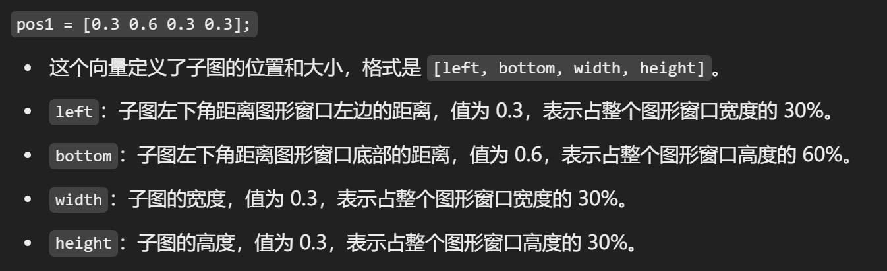
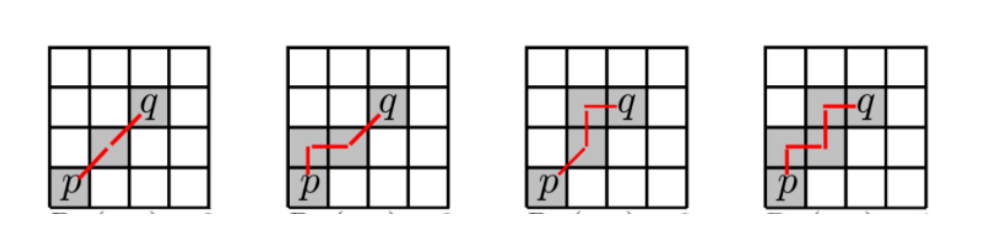
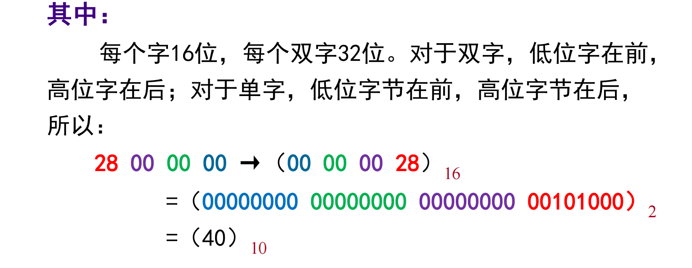
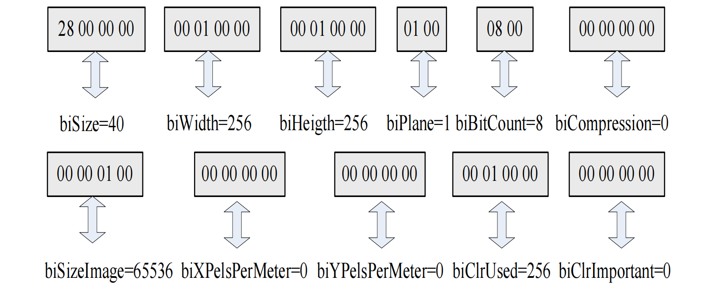

# 数字图像入门笔记

## MATLAB基础

### 变量与运算符

MATLAB 就是专门为矩阵运算服务的编程语言。
所以，几乎都是关于矩阵的运算。

**生成新矩阵 or 向量：**
- 正常写：`(1,2,3;4,5,6;7,8,9)`
- 冒号 `:` 生成（开始，步长，结束）
- `linespace` 、 `logspace` 去等分生成


```matlab
1:0.5:3;
x=linespace(1.2,5,4);
x=logsapce(1.2,5,4);
```

其中 `logspace(a,b,n)` 是在 `[a, b]` 范围内均匀分布的 `n` 个数。
也就是：$logspace(a,b,n)=10^{linespace(a,b,n)}$

**四则运算：**

matlab的四则运算基本符合线性代数的定义。
据老师透露，对于矩阵除法求解集这种操作，自己写是不如直接用的 —— 神秘的算法优化。

矩阵（向量）加减，要求形状一样；
矩阵（向量）乘除，要求 **前列后行** 相等；
矩阵（向量）有逐个元素乘除的操作，要求形状一样（哈达马尔乘积）；
针对向量还有点乘；


### 图像读、写与画图


`load(filename);`：导入一个表格的矩阵数据
`writematrix(A,filename);`：导出一个表格的矩阵数据
`imread(filename);`
`imwrite(filename);`
`iminfo(filename);`
`image(Matrix);`：显示矩阵数据为图像
`imshow(filename/Matrix);`：显示矩阵数据为图像


`imresize()`：重定大小
`imrotate()`：旋转
`imcrop()`：裁剪
`imadjust()`：增强对比度？
`imfilter()`：使用滤波
`bwareaopen()`：去除连通小块
`edge()`：边缘检测

`figure`：创建多个图形窗口
`plot(x,y)`：画直线
`subplot(m,n,p,ax)`、`subplot(m,n,p,"replace")`：控制第p个位置的子图；ax是控制单元格合并的矩阵；replace是直接清空那个图
```matlab
subplot(2, 2, 1);  % 创建第一个子图
plot(rand(1, 10));  
title('First Plot');
subplot(2, 2, 2);  % 创建第二个子图
plot(rand(1, 25));  
title('Firster Plot');
subplot(2, 2, 3);  % 创建第三个子图
plot(rand(1, 30));  
title('Firstest Plot');

subplot(2, 2, 1, 'replace');  % 删除第一个子图，重新创建
plot(rand(1, 15));  
title('Replaced Plot');
```

`subplot('Position',[left bottom width height])` 在 pos 指定的自定义位置创建坐标区。使用此选项可定位未与网格位置对齐的子图。



`axis([a b c d])`:其实就是设置
`scatter()`：散点图
`surf()`：三维曲面图
`mesh()`：三维网格图

`xlabel(str)/ylabel(str)`：设置 x 轴和 y 轴标签
`title(str)`：设置标题
`suptitle(str)`：全局的title

`bar()`：条形图统计图
`histogram()`：直方图统计图
`contour()`：等高线

### MATLAB代码的效果探索


## 数字图像类型转换

### 图像分类

首先一共有:
- 真彩色图像（真彩色是指图像中的每个像素值都分成红、绿、蓝三个基色分量）
- 索引色图像（调色板+图像每个位置上的颜色index）
- 灰度图像（0-1的浮点数 or 0-255的整数）
- 二值图像（只有两个数据，二个数值，顾名思义）
- 图像序列

互相转换的函数：
`rgb2gray(RGB)`、`gray2rgb(map)`：使用某些函数前需要转换灰度图与彩色图
`ind2rgb(X, map)`、`rgb2ind(RGB, Q)`
`gray2ind` 、 `dither`
`grayslice(I, n)`、`grayslice(I, v)`
`im2bw(I,level)`、`im2bw(X,map,level)`、`im2bw(RGB,level)`
`mat2gray(A, [amin amax])`

### 像素关系

- 4-邻接：像素相似且在四边 —— 4-连通
- 对角-邻接：像素相似且在四角 —— 
- 8-邻接：像素相似且在四边or四角 —— 8-连通
- m-邻接：像素相似且要么在四边，要么在四角 —— m-连通

$D_E$：欧几里得距离
$D_4$：曼哈顿距离
$D_8$：棋盘距离
$D_m$：混合距离（下面图中哪个是呢？）



### 位图的格式与查看

常见的有：
> BMP、JPEG 、GIF、TIFF、PCX、PNG

他们每种都有自己独特的存储方式。

TIFF：高质量格式
GIF：最简单的动画
JPEG：有层次损失
BMP：点阵式图像文件格式，位映射存储，占用的空间很大

2个字节构成1个字；2个字构成一个双字；8个bit构成一个字节；
每个字的前一个字节是低位字节，后一个字节高位字节；每个双字的前一个字是该双字的低16位，后一个字是该字的高16位



| 位图文件的 组成部分 | 各部分的标识名称 | 各部分的作用与用途 |
| --- | --- | --- |
| 位图文件头 | BITMAPFILEHEADER | 说明文件类型与偏移量，共14个字节。 |
| 位图信息头 | BITMAPINFORMATION | 说明位图的属性。共40个字节。 |
| 位图调色板 | RGBQUAD | 调色板数组，数组中的每个元素 是一个RGBQUAD结构，占4个字节 |
| 位图数据 | BYTE | 位图数据，位图的压缩格式影响这里，字节不限制。 |

利用MATLAB中的imfinfo函数显示.BMP格式

### 位图文件头

```cpp
typedef struct{
    WORD bfType;        \\ 文件类型
    DWORD bfSize;       \\ 文件大小
    WORD bfReserved1;   \\ 保留字1，约定0
    WORD bfReserved2;   \\ 保留字2，约定0
    DWORD bfoffBits;    \\ 位图阵列偏移量
}BITMAPFILEHEADER;
```

### 位图信息头

位图信息头可能长下面这样：

```Cpp
typedef short WORD;
typedef int DWORD;

typedef struct{
    DWORD biSize; // 信息头大小：固定为40
    DWORD biWidth; // 位图宽度，像素个数
    DWORD biHeight; // 位图高度，像素个数
    WORD biPlane; // 图像平面数，约定1

    WORD biBitCount; // 指定每个象素的位数，其值是1、4、8或24之一
    DWORD biCompression; // 指定压缩格式，0,1,2；

    DWORD biSizeImage; // 位图数据占用字节数

    DWORD biXPelsPerMeter; // 目标设备水平分辨率 单位是：像素/米
    DWORD biYPelsPerMeter; // 目标设备垂直分辨率 单位是：像素/米

    DWORD biClrUsed; // 位图中实际用到的颜色数
    DWORD biClrImportant; // 位图中重要的颜色数，为0时，则所有颜色都重要
}BITMAPINFOHEADER;
```

位图数据阵列中的每3个字节表示一个像素。
biSizeImage 用于指定实际的位图数据占用的字节数，其要求对应于位图阵列的每行的字节数必须是4的倍数。
每一行的字节数是4的倍数，不足的字节用0补齐

$$
biSizeImage =   \lfloor\frac{byte\_width+3}{4}\times 4\rfloor\times biHeight
$$

biClrUsed用于指定位图中实际用到的颜色数。当biClrUsed的值不为0时，其值即是调色板中的颜色数；当biClrUsed的值为0时，调色板中的颜色数由下面这个公式确定。

$$
\text{调色板中的颜色数}=
\left\{
    \begin{align*}
        &2^{biBitCount}\qquad biBitCount=1,4,8\\
        &0 \qquad biBitCount=24
    \end{align*}
\right.
$$

学会解读 bmp 的头：



### 位图调色板

每个颜色表项占1个字节

```cpp
typedef char BYTE;
typedef struct{
    BYTE rgbBlue;       \\蓝色分量
    BYTE rgbGreen;      \\绿色分量
    BYTE rgbRed;        \\红色分量
    BYTE rgbReserved;   \\保留字，约定为 0
}RGBQUAD;
```

### 查看练习


## 数字图像处理基础概念

在图像处理中，频率指单位空间内完成周期性变化的次数，即空间频率。
数字图像处理：从图像中提取信息、更适合于计算和处理的形式
图像分析：通过对图像的描述，使其更适合于计算机处理和对不同目标的分类。（机器学习里面的classification）

# Reference

