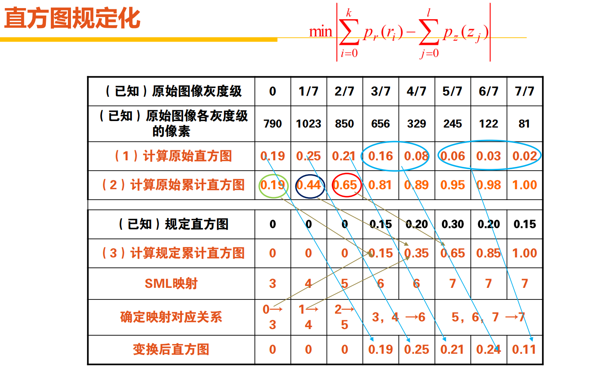
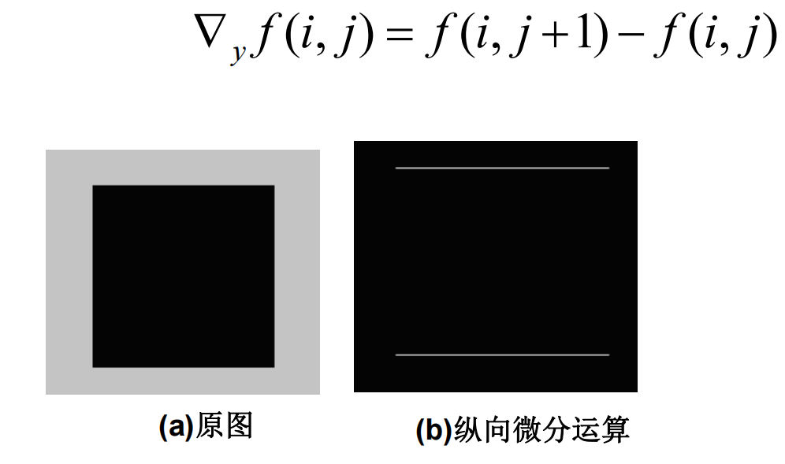

# MATLAB基础

## 变量与运算符

MATLAB 就是专门为矩阵运算服务的编程语言。
所以，几乎都是关于矩阵的运算。

**生成新矩阵 or 向量：**
- 正常写：`(1,2,3;4,5,6;7,8,9)`
- 冒号 `:` 生成（开始，步长，结束）
- `linespace` 、 `logspace` 去等分生成


```matlab
1:0.5:3;
x=linespace(1.2,5,4);
x=logsapce(1.2,5,4);
```

其中 `logspace(a,b,n)` 是在 `[a, b]` 范围内均匀分布的 `n` 个数。
也就是：$logspace(a,b,n)=10^{linespace(a,b,n)}$

**线性代数**

matlab的四则运算基本符合线性代数的定义。
据老师透露，对于矩阵除法求解集这种操作，自己写是不如直接用的 —— 神秘的算法优化。

矩阵（向量）加减，要求形状一样；
矩阵（向量）乘除，要求 **前列后行** 相等；
矩阵（向量）有逐个元素乘除的操作，要求形状一样（哈达马尔乘积）；
针对向量还有点乘；


## 图像读、写与画图


`load(filename);`：导入一个表格的矩阵数据
`writematrix(A,filename);`：导出一个表格的矩阵数据
`imread(filename);`
`imwrite(filename);`
`iminfo(filename);`
`image(Matrix);`：显示矩阵数据为图像
`imshow(filename/Matrix);`：显示矩阵数据为图像


`imresize()`：重定大小
`imrotate()`：旋转
`imcrop()`：裁剪
`imadjust()`：增强对比度？
`imfilter()`：使用滤波
`bwareaopen()`：去除连通小块
`edge()`：边缘检测

`figure`：创建多个图形窗口
`plot(x,y)`：画直线
`subplot(m,n,p,ax)`、`subplot(m,n,p,"replace")`：控制第p个位置的子图；ax是控制单元格合并的矩阵；replace是直接清空那个图
```matlab
subplot(2, 2, 1);  % 创建第一个子图
plot(rand(1, 10));  
title('First Plot');
subplot(2, 2, 2);  % 创建第二个子图
plot(rand(1, 25));  
title('Firster Plot');
subplot(2, 2, 3);  % 创建第三个子图
plot(rand(1, 30));  
title('Firstest Plot');

subplot(2, 2, 1, 'replace');  % 删除第一个子图，重新创建
plot(rand(1, 15));  
title('Replaced Plot');
```

`subplot('Position',[left bottom width height])` 在 pos 指定的自定义位置创建坐标区。使用此选项可定位未与网格位置对齐的子图。


`axis([a b c d])`:其实就是设置
`scatter()`：散点图
`surf()`：三维曲面图
`mesh()`：三维网格图

`xlabel(str)/ylabel(str)`：设置 x 轴和 y 轴标签
`title(str)`：设置标题
`suptitle(str)`：全局的title

`bar()`：条形图统计图
`histogram()`：直方图统计图
`imhist`：
`contour()`：等高线

## MATLAB代码的效果探索


# 数字图像类型

## 图像分类

首先一共有:
- 真彩色图像（真彩色是指图像中的每个像素值都分成红、绿、蓝三个基色分量）
- 索引色图像（调色板+图像每个位置上的颜色index）
- 灰度图像（0-1的浮点数 or 0-255的整数）
- 二值图像（只有两个数据，二个数值，顾名思义）
- 图像序列

互相转换的函数：
`rgb2gray(RGB)`、`gray2rgb(map)`：使用某些函数前需要转换灰度图与彩色图
`ind2rgb(X, map)`、`rgb2ind(RGB, Q)`
`gray2ind` 、 `dither`
`grayslice(I, n)`、`grayslice(I, v)`
`im2bw(I,level)`、`im2bw(X,map,level)`、`im2bw(RGB,level)`
`mat2gray(A, [amin amax])`

## 像素关系

- 4-邻接：像素相似且在四边 —— 4-连通
- 对角-邻接：像素相似且在四角 —— 
- 8-邻接：像素相似且在四边or四角 —— 8-连通
- m-邻接：像素相似且要么在四边，要么在四角 —— m-连通

$D_E$：欧几里得距离
$D_4$：曼哈顿距离
$D_8$：棋盘距离
$D_m$：混合距离（下面图中哪个是呢？）


## 位图的格式与查看

常见的有：
> BMP、JPEG 、GIF、TIFF、PCX、PNG

他们每种都有自己独特的存储方式。

TIFF：高质量格式
GIF：最简单的动画
JPEG：有层次损失
BMP：点阵式图像文件格式，位映射存储，占用的空间很大

2个字节构成1个字；2个字构成一个双字；8个bit构成一个字节；
每个字的前一个字节是低位字节，后一个字节高位字节；每个双字的前一个字是该双字的低16位，后一个字是该字的高16位


学会解读 bmp 的信息头等二进制数据：


| 位图文件的 组成部分 | 各部分的标识名称 | 各部分的作用与用途 |
| --- | --- | --- |
| 位图文件头 | BITMAPFILEHEADER | 说明文件类型与偏移量，共14个字节。 |
| 位图信息头 | BITMAPINFORMATION | 说明位图的属性。共40个字节。 |
| 位图调色板 | RGBQUAD | 调色板数组，数组中的每个元素 是一个RGBQUAD结构，占4个字节 |
| 位图数据 | BYTE | 位图数据，位图的压缩格式影响这里，字节不限制。 |

利用MATLAB中的imfinfo函数显示.BMP格式

## 位图文件头

```cpp
typedef struct{
    WORD bfType;        \\ 文件类型
    DWORD bfSize;       \\ 文件大小
    WORD bfReserved1;   \\ 保留字1，约定0
    WORD bfReserved2;   \\ 保留字2，约定0
    DWORD bfoffBits;    \\ 位图阵列偏移量
}BITMAPFILEHEADER;
```

## 位图信息头

位图信息头可能长下面这样：

```Cpp
typedef short WORD;
typedef int DWORD;

typedef struct{
    DWORD biSize; // 信息头大小：固定为40
    DWORD biWidth; // 位图宽度，像素个数
    DWORD biHeight; // 位图高度，像素个数
    WORD biPlane; // 图像平面数，约定1

    WORD biBitCount; // 指定每个象素的位数，其值是1、4、8或24之一
    DWORD biCompression; // 指定压缩格式，0,1,2；

    DWORD biSizeImage; // 位图数据占用字节数

    DWORD biXPelsPerMeter; // 目标设备水平分辨率 单位是：像素/米
    DWORD biYPelsPerMeter; // 目标设备垂直分辨率 单位是：像素/米

    DWORD biClrUsed; // 位图中实际用到的颜色数
    DWORD biClrImportant; // 位图中重要的颜色数，为0时，则所有颜色都重要
}BITMAPINFOHEADER;
```

位图数据阵列中的每3个字节表示一个像素。
biSizeImage 用于指定实际的位图数据占用的字节数，其要求对应于位图阵列的每行的字节数必须是4的倍数。
每一行的字节数是4的倍数，不足的字节用0补齐

$$
biSizeImage =   \lfloor\frac{byte\_width+3}{4}\times 4\rfloor\times biHeight
$$

biClrUsed用于指定位图中实际用到的颜色数。当biClrUsed的值不为0时，其值即是调色板中的颜色数；当biClrUsed的值为0时，调色板中的颜色数由下面这个公式确定。

$$
\text{调色板中的颜色数}=
\left\{
    \begin{align*}
        &2^{biBitCount}\qquad biBitCount=1,4,8\\
        &0 \qquad biBitCount=24
    \end{align*}
\right.
$$


## 位图调色板

每个颜色表项占1个字节

```cpp
typedef char BYTE;
typedef struct{
    BYTE rgbBlue;       \\蓝色分量
    BYTE rgbGreen;      \\绿色分量
    BYTE rgbRed;        \\红色分量
    BYTE rgbReserved;   \\保留字，约定为 0
}RGBQUAD;
```

## 查看练习


## 数字图像处理基础概念

在图像处理中，频率指单位空间内完成周期性变化的次数，即空间频率。
数字图像处理：从图像中提取信息、更适合于计算和处理的形式
图像分析：通过对图像的描述，使其更适合于计算机处理和对不同目标的分类。（机器学习里面的classification）

# 数字图像的基本运算

从严格意义上来说，图像运算仅指对图像中的**所有像素**实施了相同处理的那些运算

空间域：图像像素的简单平面
灰度变换：对单个像素进行操作
空间滤波：通过邻域的信息，处理理这个像素，最小邻域1x1

## 灰度变换
$f$一般表示输入图像，$g$一般表示输出图像。

$$g(x,y)=T(f(x,y))$$

### 灰度反转
$L$表示灰度级。256灰度级代表有0-255这256种亮度。

$$g(x,y)=L-1-f(x,y)$$

### 对数变换

$$g(x,y)=c\cdot\log(1+f(x,y))$$

1. 调高输入图像的低灰度值
2. 人的视觉感觉与进入人眼的光的强度成对数关系

## 直方图

### 灰度直方图

直方图是图像的灰度—像素个数统计图；
统计在图像中具有**该灰度值的像素出现的频数**$h(r_i)=n_i\quad(i\in\{i\in\mathbb{Z}\;|\;i\in[0,L-1]\})$，并绘制成图形
**横坐标**表示图像中像素的**灰度级**，**纵坐标**表示图像中各个灰度级像素的**数量**；灰度直方图不能表示图像中每个像素的位置(空间)信息。

灰度图像的对比度，一般用图像画面中最大的灰度值（最白）与最小的灰度值（最黑）的比值来表示。
当柱状接近分布在整个横轴上，且至少有一个峰值时，图像的对比度较好。
**归一化**直方图只是**把纵坐标上的频数换成频率**。
彩色图片的直方图（RGB）等效3个灰度直方图。

下面四个图像作为对比：

<div class="container"
    style="display: flex;
    flex-direction: column;
    /* border: 3px black solid; */
    align-items:center;
    justify-content: space-between;
    ">
    
    
    
    
</div>

## 图像的运算

### 图像相加

图像相加就是矩阵相加。

相加就是一种线性运算的关系：$g(x,y)=\alpha f_1(x,y)+(1-\alpha)f_2(x,y)$

**同一图像与其多个“副本”**的均值可以去除**加性噪声**。

首先因为：噪声是随机的，那么在无穷样本的状态下接近高斯分布 —— 任何位置都能出现。

> 图像噪声：图像噪声是一种空间上不相联系的、离散的、孤立的像素变化现象，其灰度值与它们相邻像素的灰度值有明显不同。


那么根据概率密度函数，大部分都分布在离中轴相当近的位置，以及他们的期望是0

也即，假设$I$是原图像真实的情况，那么对于$N$张相同照片的第$i$张图片：

$$f=I+noise_i$$

于是，我们有：

$$
E(noise)=\sum_i^N\frac{noise_i}{N}=0\\
D(g)=D(\sum_i^N\frac{noise_i}{N})=\frac{\sum_i^ND(noise)}{N^2}=\frac{ND(noise)}{N^2}=\frac{\sigma^2}{N}
$$

随着$N$的增大，噪声必然越来越小。


### 图像相减

图像相减就是矩阵相减。

相减**结果小于零**时，一般都是**取零为结果值**
对于某些特殊的应用目的，也**可以取其绝对值**为结果值.
典型应用是图像的**变化检测**.

### 图像的几何变换

1. 平移

$$
\left\{
    \begin{align*}
       x^{'}&=x_0+\Delta x\\
       y^{'}&=y_0+\Delta y
    \end{align*}
\right.\\
\Big\Downarrow\\
\begin{bmatrix} 
    x^{'} \\ y^{'} \\ 1 
\end{bmatrix} =
\begin{bmatrix} 
    1 & 0 & \Delta x \\ 
    0 & 1 & \Delta y \\ 
    0 & 0 & 1 
\end{bmatrix}
\begin{bmatrix} 
    x_0 \\ y_0 \\ 1 
\end{bmatrix}
$$

2. 旋转

根据复平面上的向量内积，我们可以写出旋转公式：

$$
\left\{
    \begin{align*}
       x^{'}&=x_0\cos\beta+y_0\sin\beta\\
       y^{'}&=-x_0\sin\beta+y_0\cos\beta
    \end{align*}
\right.\\
\Big\Downarrow\\
\begin{bmatrix} 
    x^{'} \\ y^{'} \\ 1 
\end{bmatrix} =
\begin{bmatrix} 
    \cos\beta & \sin\beta & 0 \\ 
    -\sin\beta & \cos\beta & 0 \\ 
    0 & 0 & 1 
\end{bmatrix}
\begin{bmatrix} 
    x_0 \\ y_0 \\ 1 
\end{bmatrix}
$$

而由于我们图像的坐标是在左上角：


所以还需要对坐标进行一步变换：

真实坐标：

$$
\left\{
    \begin{align*}
        x^{'}&=x_0\cos\beta+y_0\sin\beta\\
        y^{'}&=-x_0\sin\beta+y_0\cos\beta\\
        x_{real}^{'}&=0.5h-y^{'}\\
        y_{real}^{'}&=0.5w+x^{'}
    \end{align*}
\right.\\
\Big\Downarrow\\
\begin{bmatrix} 
    x_{real}^{'} \\ y_{real}^{'} \\ 1 
\end{bmatrix} =
\begin{bmatrix} 
    0 & -1 & 0.5h \\ 
    1 & 0 & 0.5w \\ 
    0 & 0 & 1 
\end{bmatrix}
\begin{bmatrix} 
    \cos\beta & \sin\beta & 0 \\ 
    -\sin\beta & \cos\beta & 0 \\ 
    0 & 0 & 1 
\end{bmatrix}
\begin{bmatrix} 
    x_0 \\ y_0 \\ 1 
\end{bmatrix}
$$

3. 水平镜像变换

$$
\left\{
    \begin{align*}
       x^{'}&=x_0\\
       y^{'}&=w-y_0
    \end{align*}
\right.\\
\Big\Downarrow\\
\begin{bmatrix} 
    x^{'} \\ y^{'} \\ 1 
\end{bmatrix} =
\begin{bmatrix} 
    1 & 0 & 0 \\ 
    0 & -1 & w \\ 
    0 & 0 & 1 
\end{bmatrix}
\begin{bmatrix} 
    x_0 \\ y_0 \\ 1 
\end{bmatrix}
$$


4. 垂直镜像变换

$$
\left\{
    \begin{align*}
       x^{'}&=h-x_0\\
       y^{'}&=y_0
    \end{align*}
\right.\\
\Big\Downarrow\\
\begin{bmatrix} 
    x^{'} \\ y^{'} \\ 1 
\end{bmatrix} =
\begin{bmatrix} 
    -1 & 0 & h \\ 
    0 & 1 & 0 \\ 
    0 & 0 & 1 
\end{bmatrix}
\begin{bmatrix} 
    x_0 \\ y_0 \\ 1 
\end{bmatrix}
$$

5. 图像的转置

$$
\left\{
    \begin{align*}
       x^{'}&=y_0\\
       y^{'}&=x_0
    \end{align*}
\right.\\
\Big\Downarrow\\
\begin{bmatrix} 
    x^{'} \\ y^{'} \\ 1 
\end{bmatrix} =
\begin{bmatrix} 
    0 & 1 & 0 \\ 
    1 & 0 & 0 \\ 
    0 & 0 & 1 
\end{bmatrix}
\begin{bmatrix} 
    x_0 \\ y_0 \\ 1 
\end{bmatrix}
$$

6. 放大缩放

$$
\left\{
    \begin{align*}
       x^{'}&=rx_0\\
       y^{'}&=ry_0
    \end{align*}
\right.\\
\Big\Downarrow\\
\begin{bmatrix} 
    x^{'} \\ y^{'} \\ 1 
\end{bmatrix} =
\begin{bmatrix} 
    r & 0 & 0 \\ 
    0 & r & 0 \\ 
    0 & 0 & 1 
\end{bmatrix}
\begin{bmatrix} 
    x_0 \\ y_0 \\ 1 
\end{bmatrix}
$$


7. 缩放算法

- 图像缩小

比如：下采样、降采样
直接去掉这个图像的奇数行偶数行

- 按整数倍放大图像的最近邻域插值法

将原图像中的每个像素原封不动地复制到放大后的每一个像素。

- 按非整数倍放大图像的最近邻域插值法

比如：映射法
新图像上的点按照比例算回旧图像，对比离哪个点最近，就取哪个点的数值。

- 双线性插值放大法

新图像上的点按照比例算回旧图像，假设在$f(x,y)$。
那么根据原图像的灰度进行两次插值计算，得到最终的结果。

# 图像的增强

图像增强就是通过对图像的某些特征，如边缘、轮廓、对比度等，进行强调或尖锐化，使之更适合于人眼的观察或机器的处理的一种技术。


## 空间域上

在图像平面中对图像的像素灰度值直接进行运算处理

### 点运算

逐像素点对图像进行增强

1. 对比度拉伸

<div class="container" style="display: grid;grid-template-columns: 1fr 1fr;gap:10px 0;width:100vw;align-items:center;justify-items:center;">
    
    
    
    
    <!--  -->
    
    
    
    
</div>


1. 窗切片（灰度切片）

给所关心的灰度范围指定一个较高的灰度值；其它部分指定一个较低的灰度值或0值，不管也行。


### 直方图均衡 - 基于变上限积分的方法

通过全部或局部地改变图像的对比度。

根据图表分析：当一幅图像的像素占据了所有可能的灰度级范围并呈均匀分布时，则该图像具有**比较高的对比度**和**多变的灰度色调**。

所以基于直方图的增强方法，就是从相对比较集中的某个灰度区间变成在全部灰度范围内的均匀分布，来进行图像增强的方法。

变换后的灰度要求保证**从黑到白**的单一变化顺序，并且**变换范围与原先一致**；

其主要思想是，将一副图像的直方图分布通过累积分布函数变成近似均匀分布，从而增强图像的对比度。

由概率论中的知识[^1]，我们意外得知如果对归一化的直方图里面的数据进行积分，把积分之后的值代替积分前的数值，那么我们就能得到一个更加平滑的图像。

假设变上限定积分函数：$p^{'}_x=\int_0^{x}p_i=\sum_{0}^{x}p_i$

当然，我们不能直接改个频率就当做整个图像变了 —— 所以我们还要倒回去改每个像素的数值。

至于怎么改 …… 不可能对着表格要求一个一个改然后验证吧 —— 所以大概改个整数出来就行了。

对于：$p^{'}_x$，其改变后的数值是：$x^{'}=Round((L-1)\times p^{'}_x)$

### 直方图规定化 - 基于已知函数的反函数的方法

直方图规定化就是一种把已知直方图的图像变换成具有某种特定分布直方图的图像增强方法。

如果期望求到一个目标分布$G(z)=\int p^{'}_x$，那么我们就需要把所有的像素点挨个从$i$变成$z$.
鉴于我们在变换完成之后，我们有$G(z)=\int p(i)$的关系；
其实我们直接计算$z=G^{-1}(\int p(i))$，然后进行逐元素替换即可。

对于离散的情况，我们就找积分后的概率最相近的部分，然后进行替换即可 —— 这是最简单的方法。



**思考**：

为什么要先求积分然后再求反函数呢？

PDF（概率密度函数）不一定可直接反函数，CDF（累计分布函数）才是单调可逆；
因为函数可逆性的一个基本要求是单调或至少“严格单调”；如果直接求p^{'}_x的反函数，可能就求不出来了，但是积分过后，根据 概率恒大于0 这个性质，我们就能保证一定有反函数了。


### 重要概念：卷积

利用模板或掩模对图像的邻域像素进行处理。


所谓卷积，其实就是把一个函数卷(翻)过来，然后与另一个函数求内积。

卷积是一个“反转后平移”的操作。
和的卷积就可以写成：$$(f*g)(x)=\int_{-\infin}^{\infin}f(\tau)g(x-\tau)$$

**举例**：同时掷两个骰子1次，它们正面朝上数字和为4的概率是多少？
$$P{X=4}=(f*g)(4)=\sum_{-\infin}^{\infin}f(\tau)g(4-\tau)=\sum_{\tau=1}^{3}f(\tau)g(4-\tau)$$

写成内积的形式就是：$$\begin{bmatrix}f(1)\\ f(2)\\\vdots\\ f(n-1)\end{bmatrix}\cdot\begin{bmatrix}g(x-1)\\ g(x-2)\\\vdots\\ g(1)\end{bmatrix}$$

**有的时候函数里面是可以取0的，这一点要注意**。

求相关 (Correlation)的时候，直接逐点相乘并求和即可。
求卷积 (Convolution)的时候，要把其中一个序列数先前后反转，然后直接逐点相乘并求和即可[^2]。


| 性质 | 卷积 | 相关 |
| --- | --- | --- |
| 交换律 | $f* g=g*f$         | 不成立 |
| 结合律 | $f*(g*h)=(g*f)*h$  | 不成立 |
| 分配律 | $f*(g+ h)=f*g+f*h$ | 成立 |

**边界延拓**

补零延拓：0像素值填充扩充的边界值
对称延拓：最边缘像素为轴对称复制
复制延拓：复制最边缘像素为轴
循环延拓：另外一边边界上的像素补偿填充


<div class="contain" style="display: flex;justify-content: space-around;">
    
    
</div>

### 空间滤波 - 基于卷积运算的方法

图像噪声：图像噪声是一种空间上不相联系的、离散的、孤立的像素变化现象，其灰度值与它们相邻像素的灰度值有明显不同。

椒盐噪声
脉冲噪声

高频信号：图中**变化剧烈**的部分，例如边缘和噪声等，称为高频信号。
低频信号：图中**变化平缓**的部分，称为低频信号。

低通滤波：把保留低频信号并**滤掉高频信号**的处理过程，称为低通滤波。（平滑）
高通滤波：把保留高频信号并**滤掉低频信号**的处理过程，称为高通滤波。（锐化）

**邻域平均法实现线性平滑滤波**


邻域越大，在去噪能力增强的同时模糊程度越严重


**超限像素邻域平均法实现线性平滑滤波**


**均值滤波法实现线性平滑滤波**


**空间滤波器的模板**

考虑几个问题：

1. 滤波器的系数根据其支持怎么样的操作来选择
2. 线性滤波的作用是实现乘积求和操作：加权求和
3. 非线性滤波要求确定邻域大小，以及对包含在邻域内的图像像素执行的操作


**利用多幅同一场景图像实现线性平滑滤波**

上面在“图像加法部分”提及过了。

**中值滤波实现非线性平滑滤波**

中值滤波是一种基于排序统计理论的非线性滤波方法
对原图像中被该窗口覆盖的所有像素的灰度值进行排序，用其中间值代替结果图像中对应于滤波窗口最中间的那个像素点的灰度值。


**去噪效果比较**

对于椒盐噪声，**中值**滤波效果比**均值**滤波效果好。
对于高斯噪声，**均值**滤波效果比**中值**滤波效果好。

椒盐噪声是幅值近似相等但随机分布在不同位置上，图像中有干净点也有污染点。中值滤波是选择适当的点来替代污染点的值，所以处理效果好。因为噪声的均值不为0，所以均值滤波不能很好地去除噪声点。

高斯噪声是幅值近似正态分布，但分布在每点像素上。因为正态分布的均值为0，所以均值滤波可以消除噪声。因为图像中的每点都是污染点，所以中值滤波选不到干净点。

### 基于差分的方法

函数的增长率就是梯度。
一元函数的梯度只由一个方向构成，所以梯度=导数；
那么二元函数的梯度，由两个方向构成，大小也是两个方向上导数的平方和。
也即：
$$
\begin{align*}
f^{'}(x)&=\frac{df(x)}{dx}=\lim_{\Delta x\rightarrow0}\frac{f(x+\Delta x)}{\Delta x}\\
f^{'}_x(x,y)&=\frac{\partial f(x,y)}{\partial x}=\lim_{\Delta x\rightarrow0}\frac{f(x+\Delta x,y)}{\Delta x}\\
\nabla f(x,y)&=\frac{\partial f(x,y)}{\partial x}\vec{x}+\frac{\partial f(x,y)}{\partial y}\vec{y}=(\frac{\partial f(x,y)}{\partial x},\frac{\partial f(x,y)}{\partial y})\\
G(x,y)&=\sqrt{(\frac{\partial f(x,y)}{\partial x})^2+(\frac{\partial f(x,y)}{\partial y})^2}\\
\phi(x,y)&=arctan(\dfrac{\frac{\partial f(x,y)}{\partial y}}{\frac{\partial f(x,y)}{\partial x}})
\end{align*}
$$

那么根据这一种理解，我们很容易写出 “整数” 形式的 “导数”（差分）：

$$G(x,y)=\sqrt{(f(i+1,j)-f(i,j))^2+(f(i,j+1)-f(i,j))^2}$$

但是平方计算量大，所以还可以简化为**水平垂直差分法**：

$$G(x,y)=|f(i+1,j)-f(i,j)|+|f(i,j+1)-f(i,j)|$$

写成滤波模板的话：

$$
G_x=
\begin{bmatrix}
    1&-1\\
    0&0
\end{bmatrix} \qquad
G_y=
\begin{bmatrix}
    1&0\\
    -1&0
\end{bmatrix}
$$

<div class="container"
    style="display: flex;
    flex-direction: column;
    align-items:center;
    justify-content: space-between;
    row-gap:10px
    ">
    
    
    
</div>

**罗伯特差分法**：

$$G(x,y)=|f(i+1,j+1)-f(i,j)|+|f(i+1,j)-f(i,j+1)|$$
$$
G_x=
\begin{bmatrix}
    1&0\\
    0&-1
\end{bmatrix} \qquad
G_y=
\begin{bmatrix}
    0&1\\
    -1&0
\end{bmatrix}
$$

**Sobel算子**

$$
d_x=\begin{bmatrix}1&0&-1\\2&0&-2\\1&0&-1\end{bmatrix}
\qquad
d_y=\begin{bmatrix}-1&-2&-1\\0&0&0\\1&2&1\end{bmatrix}
$$

**Prewitt算子**

$$
S_x=\begin{bmatrix}1&1&1\\0&0&0\\-1&-1&-1\end{bmatrix}\qquad
S_y=\begin{bmatrix}1&0&-1\\1&0&-1\\1&0&-1\end{bmatrix}
$$

**增强方法**

直接使用梯度会得到黑白图 —— 显然不是我们想要的东西。
将梯度的数值叠加到图像上才是我们想要的增强效果。

### 基于二阶差分

根据定义，二阶差分就是离散的二阶导数。


对于连续函数，我们有梯度算子和散度算子：
$$
\nabla f(x,y)=(\frac{\partial f(x,y)}{\partial x},\frac{\partial f(x,y)}{\partial y})\\
\nabla \vec F(x,y)=\frac{\partial F_x}{\partial x}(x,y)+\frac{\partial F_y}{\partial x}(x,y)
$$

所以我们结合梯度和散度，得到拉普拉斯算子：

$$
\begin{align*}
\nabla^2 f(x,y)&=\nabla \nabla f(x,y)\\
&=\nabla (\frac{\partial f(x,y)}{\partial x},\frac{\partial f(x,y)}{\partial y})\\
&=\dfrac{\partial \frac{\partial f(x,y)}{\partial x}}{\partial x}(x,y)+\dfrac{\partial \frac{\partial f(x,y)}{\partial y}}{\partial y}(x,y)\\
&=\frac{\partial^2 f(x,y)}{\partial x^2}+\frac{\partial^2 f(x,y)}{\partial y^2}
\end{align*}
$$

拉普拉斯算子在一定意义上可以看作是二元函数中“**一元函数的二阶导数**”的推广，用来描述函数梯度的整体变化率或局部平滑性 —— 而不是简单地对函数求二阶偏导数来表示。

继续根据连续函数的意义转换成离散版本的：

$$
\begin{align*}
\nabla^2 f&=(\nabla f(i+1,j)-\nabla f(i,j))+(\nabla f(i,j+1)-\nabla f(i,j))\\
&=((f(i+2,j)-f(i+1,j))-(f(i+1,j)-f(i,j)))
\\&+((f(i,j+2)-f(i,j+1))-(f(i,j+1)-f(i,j)))\\
&=f(i+2,j)-2f(i+1,j)+f(i,j)+f(i,j+2)-2f(i,j+1)+f(i,j)\\
&=\begin{bmatrix}
    0&f(i,j+1)&0\\
    f(i+1,j)&-4f(i+1,j+1)&f(i+1,j+2)\\
    0&f(i+2,j+1)&0
\end{bmatrix}\\
&=\begin{bmatrix}
f(i,j)&f(i,j+1)&f(i,j+2)\\
f(i+1,j)&-4f(i+1,j+1)&f(i+1,j+2)\\
f(i+2,j)&f(i+2,j+1)&f(i+2,j+2)
\end{bmatrix}
\begin{bmatrix}
0&1&0\\
1&-4&1\\
0&1&0
\end{bmatrix}\\
&=\sum_{s=-1}^{1}\sum_{t=-1}^{1} f(i+s,j+t)H(s,t)
\end{align*}
$$

<div class="container"
    style="display: flex;
    flex-direction: column;
    align-items:center;
    justify-content: space-between;
    row-gap:10px
    ">
    
    
</div>


## 频率域上

在图像的频率域中对图像进行增强处理

# Reference

[^1]:https://www.cnblogs.com/jiujiubashiyi/p/16413228.html
[^2]:动图网站：
https://towardsdatascience.com/convolution-vs-correlation-af868b6b4fb5/
https://www.songho.ca/dsp/convolution/convolution2d_example.html
