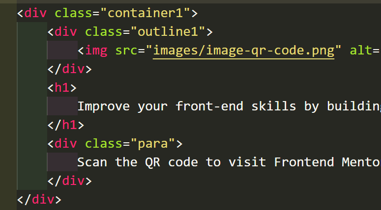
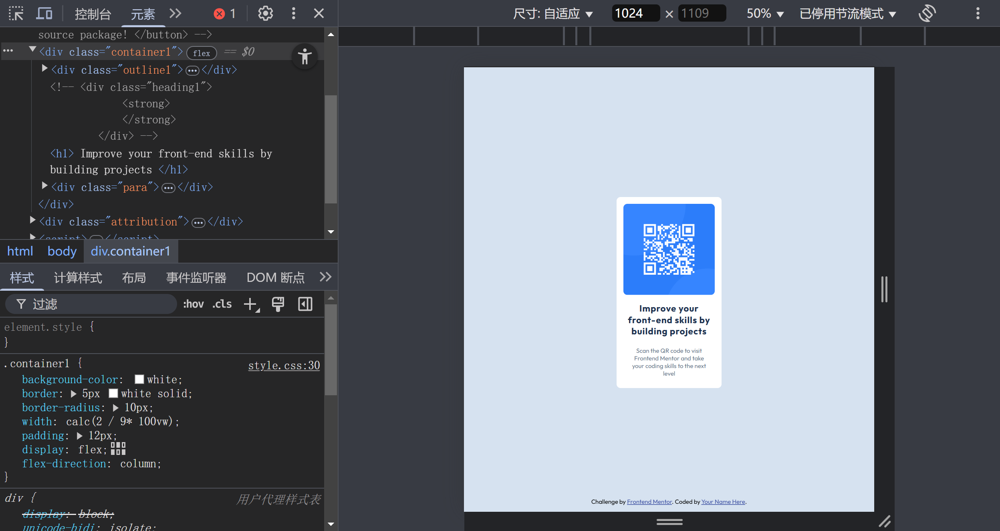
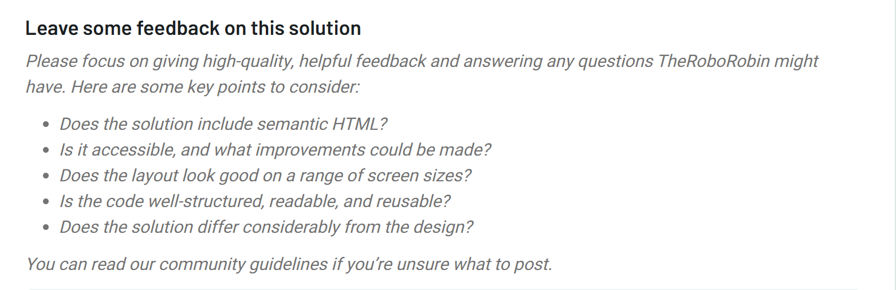

# Tasks

## Basic Dev tools

To make page available for different sceen sizes , we  need to use Media queries to place distinct layout under width and height of different equipments.


At first , it is too big when generated on OJ:


which seems great on local :


1. It's crucial not to let element inside to overflow .

2. It's also important to use relative sizing to a proper —— when measuring size of elemnts , we have better use some tools like pixel master (?I remember).

So，changing the height to 50 vh

whilst it overflow the container's border when placed on my site.


It turn out to be a mistake that restricting the real height of the container , for elements and content which can not fit right into it will certainly over flow —— why not just make  themselves decide on how height they will be?



And thereby , just width left , with calc() used.


The principal problem is that i haven't use any web dev tools yet , it's pretty useful.

And at the time I set the viewport to 1440 , everything seems getting easier because I get more close to the real state or real way which this OJ process my hypertext doc by.  




and whenever we modify our cascading style sheet, we ought to update them in the relavent file —— which makes CSS writing more fluent.

& up to now, I haven't find any modification to the CSS file can be made through the UA or browser itself -- I suppose it somehow defys or violates the Secure provision for local/remote files. 


## Media queries


just choose how big the screen is , and then set the font-size properly.

notbly, father element and son element might not set the padding and margin  as well , because it's really hard to change so much properties at a time.


```
@media screen and (max-width:1280px){
    .container1{
        padding: 1.3rem;
    }
    .attribution{
        font-size: 1.3rem;
    }
}

@media screen and (max-width:1160px){
    .container1{
        padding: 1.1rem;
    }
    .container1 > h1 {
        font-size: 1.3rem;
    }
    .attribution{
        font-size: 1rem;
    }
}

@media screen and (max-width:950px){
    .container1{
        padding: 0.8rem;
    }
    .container1 > h1 {
        margin: 0.8rem  1rem;
        font-size: 1.1rem;
    }
    .para{
        margin: 0.8rem 1rem;
        font-size: 0.8rem;
    }
    .attribution{
        font-size: 0.8rem;
    }
}
```


Is there any a much more conveient way?

for phone screen , I merely focus on the width while I forget to change the size of the height --- that seems very not good !


## transform

& i want to set this "copyright-like" thing in the middle at the bottom.


 

## result

roughly the same?



