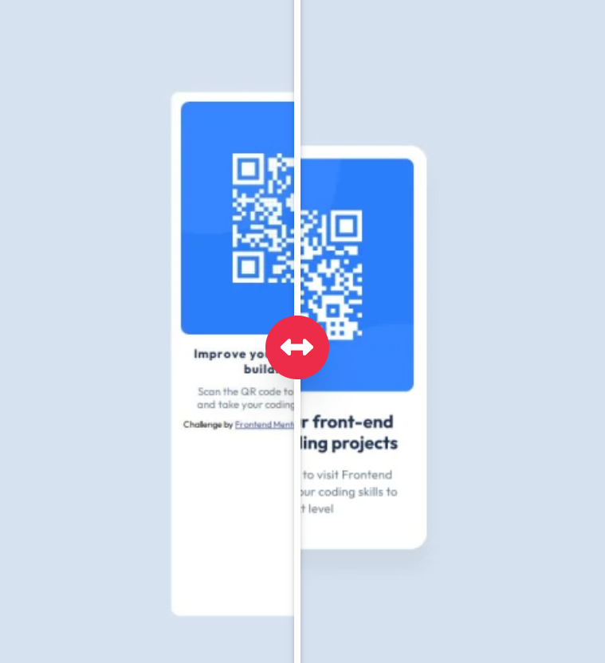
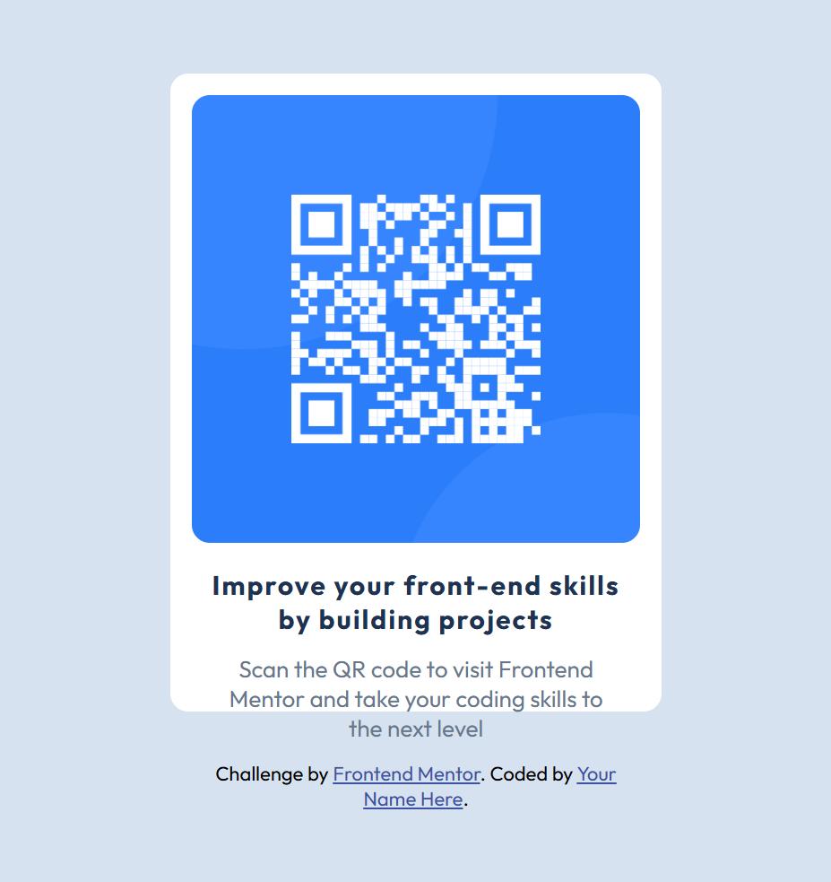

# Tasks

## Media queries

To make page available for different sceen sizes , we  need to use Media queries to place distinct layout under width and height of different equipments.

At first , it is too big when generated on OJ:

which seems great on local :

1. It's crucial not to let element inside to overflow .

2. It's also important to use relative sizing to a proper —— when measuring size of elemnts , we have better use some tools like pixel master (?I remember).

So，changing the height to 50 vh

whilst it overflow the container's border when placed on my site.

